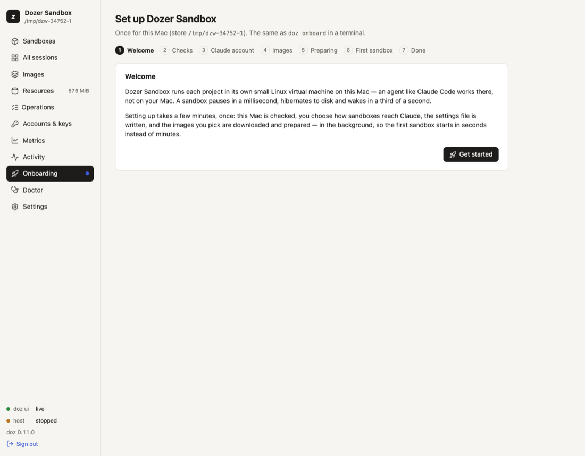

# Getting started

Dozer Sandbox runs AI coding agents, such as Claude Code, in small Linux virtual machines on your
Mac. Each agent gets its own **sandbox**: its own disk, a network that only reaches what you allow,
and (if you want) one project folder shared in. A sandbox pauses in about a millisecond, sleeps or
hibernates to disk, and wakes in about a third of a second with the agent still where you left it.

This page takes you from nothing installed to talking to Claude in a sandbox in about 15 minutes.
Most of that is a one-off download that you can leave running in the background.

**On this page:** [What you need](#what-you-need) · [Install](#install) ·
[Set up this Mac](#set-up-this-mac) · [Your first project](#your-first-project) ·
[Talk to your agent](#talk-to-your-agent) · [Day to day](#day-to-day) ·
[When the agent needs a website](#when-the-agent-needs-a-website) · [Undo](#undo-with-restore-points) ·
[Next steps](#next-steps)

## What you need

- A Mac with **Apple silicon** (M1 or later) running **macOS 26 or later**.
- About **5 GB of free disk** for the first image. Sandboxes share their disks with the image they
  came from, so each extra sandbox usually adds only megabytes.
- An internet connection for the first setup.
- **Optional:** [Claude Code](https://claude.com/claude-code) installed and signed in on your Mac.
  Your sandboxes can then use that login, with nothing to paste. You can use an API key or a
  long-lived token instead, or decide later.

## Install

With [Homebrew](https://brew.sh):

```sh
brew trust --tap dozer-sandbox/tap   # once per Mac: Homebrew loads a third-party tap's formulas only once trusted
brew install dozer-sandbox/tap/doz
doz --version
```

The install takes seconds (a prebuilt, signed `doz`) and ends with a hint: `doz onboard`. More on
installing, upgrading and removing: [Installing, upgrading and uninstalling](02-install-upgrade-uninstall.md).

## Set up this Mac

Setup happens once per Mac. It checks that your Mac can run sandboxes, connects your Claude account,
and prepares the agent's image so your first sandbox starts in seconds. Do it in the terminal or in
your browser; both do the same thing.

**In the terminal:**

```sh
doz onboard
```

At each question the recommended answer is already selected: press **Enter** to take it.

1. **Checks.** Apple silicon, macOS, the virtualization permission, disk space. A required check
   that fails stops setup and says why; an optional one (Claude Code not installed, for example) is
   a warning.
2. **Your Claude account.** If Claude Code is signed in on this Mac, Dozer offers to use that login.
   Otherwise paste an API key or a `claude setup-token` token (it is never echoed), or choose
   *Decide later*.
3. **Images.** **Claude Code** is ticked; **pi** and the plain **lab** shell are optional. Anything
   you leave out is prepared the first time you use it.
4. **Preparing.** Dozer downloads the base system and installs the agent and its tools inside a VM.
   It takes a few minutes. **You don't have to wait:** press **Ctrl-C** and it carries on in the
   background; `doz onboard --status` shows it again.

**In your browser:**

```sh
doz ui
```

The dashboard opens on the **setup wizard**: the same steps, and at the end an optional **First
sandbox**.



Details: [Setting up](03-setting-up.md).

### What you just set up

<!-- A hand-drawn diagram of these parts is to come here. -->

- **Each sandbox is a small Linux virtual machine,** not a container, with its own kernel and disk.
  It can't see your Mac's files, apart from the one project folder you share at `/workspace`.
- **The Dozer host runs the sandboxes.** It's a background program that starts when you need it and
  exits when nothing is running. `doz` and the dashboard are remote controls for it.
- **Sandboxes sit behind a network proxy on your Mac.** They have no network card of their own:
  every connection goes through the proxy, which allows only what you permit, and logs it.
- **Your credentials never enter a sandbox.** The agent sees a stand-in; the proxy adds your real
  login as each request leaves for Anthropic.
- **Two files hold your choices:** `~/.config/dozer-sandbox/doz.toml` (your settings for this Mac)
  and a project's `doz_project.yaml` (its sandbox). Everything else is kept by the host.

## Your first project

A sandbox works on one project folder, shared into it at `/workspace`: the agent's changes appear on
your Mac at once, and your editor sees them live.

```sh
cd ~/code/my-app
doz init
```

`doz init` asks for the sandbox's name (from the folder's) and its image, and writes
`doz_project.yaml` in the folder. It holds no secrets, so you can commit it: anyone who runs
`doz up` in the project gets the same sandbox.

```sh
doz up
```

The first time, this creates the sandbox and starts it in a few seconds (setup prepared the image
already). After that, `doz up` in the folder wakes the same sandbox. Either way it opens the agent
in your terminal.

> **Detach, don't quit.** Press **Ctrl-]** twice to leave the sandbox (once opens a small menu at
> the bottom: `d detach · n next · p prev · s sessions · Esc back`). The agent keeps running, and
> `doz up` brings you straight back to it.

Your terminal's title shows where you are, for example `my-app · claude · 14:05`, and goes back to
what it was when you detach. Details: [Projects](04-projects.md) and
[Terminals and sessions](07-terminals-and-sessions.md).

> **No project yet?** `doz new` — or **Quick add** in the dashboard — makes a sandbox with every
> default and puts you in it: a free name like `claude-sandbox`, and its own folder in your projects
> folder (`~/Developer/dozer-sandbox-projects/claude-sandbox`). See
> [The quickest way](05-sandboxes-and-lifecycle.md#the-quickest-way-quick-add-and-doz-new).

## Talk to your agent

You're now in Claude Code, inside the sandbox. Its first-run screens are done and it doesn't stop to
ask permission for each command: inside a sandbox, the VM and its network are the boundary. (To have
Claude ask first anyway, see `claude.permissions` in the [settings](15-settings-reference.md).)

Claude also knows where it runs. Ask it:

> where are you running, and where is /workspace on my Mac?

It should tell you it is in a Dozer sandbox (a Linux VM on your Mac), that `/workspace` is your
`~/code/my-app`, that its network only reaches what you allow, and that your credentials are added
by your Mac and never stored in the sandbox. It learns this from a short note Dozer gives it at every
start. See [Agents and accounts](09-agents-and-accounts.md).

A few things work as you'd hope:

- **It can install system packages.** The agent has passwordless `sudo` inside its sandbox, so
  `sudo apt-get install -y …` works (Debian-based images) — and never stops to ask questions.
- **Its clock is yours.** A sandbox follows your Mac's time zone, even after it slept while you
  travelled.
- **Copying works.** When Claude copies something, it lands on your Mac's clipboard and a notice
  says so.
- **Browser sign-ins work.** If a tool in the sandbox opens a sign-in page, it opens in your Mac's
  browser, and the login completes. See [Signing in from a sandbox](11-signing-in-from-a-sandbox.md).

## Day to day

A sandbox you're not using doesn't have to hold your Mac's memory. Each of these brings the agent
back exactly where it was: same conversation, same running programs.

| | what happens | memory | back in |
|---|---|---|---|
| `doz pause my-app` | frozen instantly | kept | ~1 ms |
| `doz sleep my-app` | frozen and saved to disk, so it survives a crash | kept | ~0.3 s |
| `doz hibernate my-app` | saved to disk, and the VM stops | **given back to your Mac** | ~0.3 s |

`doz wake my-app`, or simply `doz up` in the project folder, brings it back. `doz ls` lists your
sandboxes; the dashboard (`doz ui`) shows the same thing with a live terminal for each.

`doz shutdown` is a real power-off: running programs end but the disk is kept. `doz reset` goes back
to a fresh copy of the image. Neither touches your project folder or the agent's own settings and
history. Details: [Sandboxes and their lifecycle](05-sandboxes-and-lifecycle.md).

## When the agent needs a website

A sandbox has no network card of its own. Every connection goes through a proxy on your Mac that
checks a short list of **permissions** and logs the connection. The **Standard** permissions let a
coding agent talk to its AI model, update itself, install system packages and your language's
packages, use GitHub and send its own error reports. Anything else is refused and logged.

```sh
doz net my-app                              # what the agent may do, and what it was refused lately
doz net allow my-app install:python         # a permission, live
doz net allow my-app site:api.example.com   # one site
```

In the dashboard, the sandbox's details show **What the agent can do** as switches, with a one-click
suggestion when the agent was refused something. The agent can't change its own permissions; only
you can. Details: [What the agent can do](10-permissions-and-network.md).

## Undo with restore points

Before letting an agent loose on something risky, take a restore point. It takes milliseconds and
uses almost no disk until things change:

```sh
doz point take my-app before-refactor
doz point revert my-app before-refactor        # go back
doz point fork my-app before-refactor try-2    # or try again in a new sandbox, from the same moment
```

Restore points cover the sandbox's own disk. Your project folder is on your Mac, so use git for that.
Details: [Restore points, duplicates and templates](12-restore-points-duplicates-templates.md).

## Next steps

- Something not working? `doz doctor`, then [Troubleshooting and FAQ](17-troubleshooting-and-faq.md).
- Let the agent you already use on your Mac drive Dozer: [Letting another agent drive Dozer](14-letting-another-agent-drive.md).
- How your Mac is kept safe: [Security model](16-security-model.md).
- Everything else: the [manual's index](README.md).
