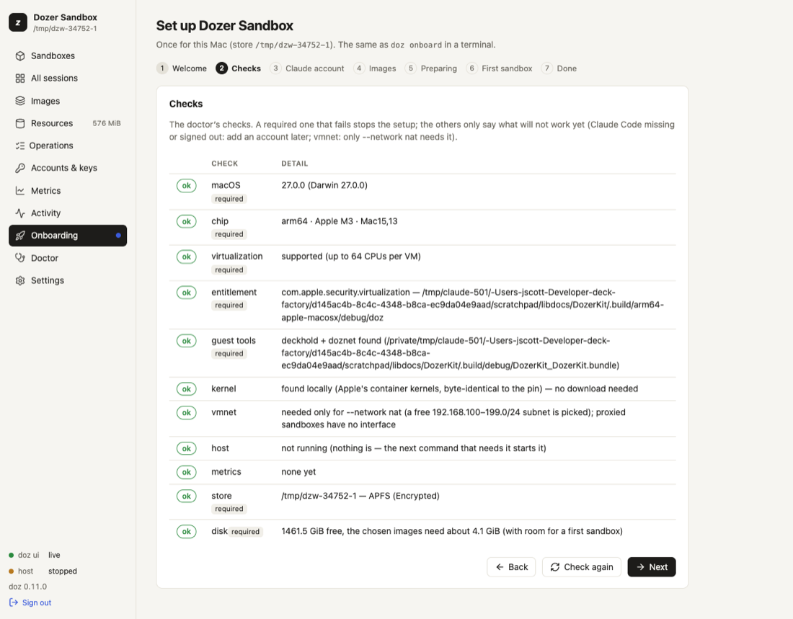

# Setting up this Mac

Setup — **onboarding** — is what you do once after installing: it checks your Mac, chooses and
confirms what sandboxes may use as you (**Access**: a Claude account, GitHub, your SSH agent), explains
**workspace rules** and lets you choose what they do, writes your settings and prepares the images your
sandboxes start from. You can do it in the
terminal (`doz onboard`) or in the browser (the dashboard's setup wizard). Both do exactly the same
thing, and both are safe to run again.

## Concepts

- **An image** is what a sandbox starts from: a prepared disk with Linux, a developer toolkit and,
  for the agent images, the agent. Preparing one downloads a base system and installs everything in a
  temporary VM — a few minutes, once. Every sandbox made from it is an instant copy. See
  [Images and bases](08-images-and-bases.md).
- **Preparation runs in the host**, not in your terminal. You can close the terminal or leave the
  wizard; it carries on. A sandbox started while its image is being prepared joins that preparation
  instead of starting another one.
- **An account** is how a sandbox's agent pays for its AI model: your Mac's Claude Code login, a
  long-lived token, or an API key. The secret stays on your Mac; a sandbox only ever sees a stand-in.
  See [Agents and accounts](09-agents-and-accounts.md).
- **Access** is every credential a sandbox may use as you — the Claude account, **GitHub as you**
  ([GitHub](18-github.md)) and **SSH agent forwarding**. Each is a choice of yours (GitHub and SSH are
  off until you choose them), and each is **confirmed live** when you choose it. A credential that
  can't be confirmed can be **skipped**: the choice is kept, marked *not confirmed*, and setup goes on.
  The choices are the defaults for new sandboxes; `doz access` and **Settings** › **Access** check
  them again later.
- **Workspace rules** are two small files you can put in a project folder: `.dozignore` (paths the agent
  must not use) and `.dozreadonly` (paths it may read but not change). Setup explains them and asks one
  question: should a `.dozignore` **lock** the paths it lists (still listed, but nothing can open them —
  the default) or **hide** them (not there at all)? See [Workspace rules](20-workspace-rules.md).

## In the terminal

```sh
doz onboard
```

On a terminal it asks; **Enter** always accepts the recommended answer.

1. **Checks** — the same checks as `doz doctor`. The required ones stop setup when they fail: Apple
   silicon, macOS 26 or later, virtualization, the signed program, the store on an APFS disk with room
   for the chosen images, and a store path short enough. The rest only warn: Claude Code missing or
   signed out (you can add an account later), and the NAT network helper (only `--network nat`
   needs it).
2. **Access** — what sandboxes may use as you, each offered and never done behind your back:
   - **Claude account**: **Use this Mac's login** (the default when Claude Code is signed in here);
     **an API key** or **a setup token** (from `claude setup-token`), pasted at a hidden prompt,
     checked with one tiny request and stored in your login keychain, then made the default; or
     **Decide later** — nothing changes.
   - **GitHub as you**: *Off* (the default), *Read-only* or *Read and push* — and where the token
     comes from: this Mac's `gh` login, or a token you paste (best: a fine-grained one).
   - **SSH agent forwarding**: *Off* (the default) or *On*.

   Each choice has a one-line consequence beside it. Then each is **confirmed**:

   ```
   ✓ Claude account        mac              confirmed — this Mac's Claude Code login (you@example.com), max
   ✓ GitHub as you         read (gh login)  confirmed — signed in as you — scopes: repo, read:org (from this Mac's gh login)
   ✗ SSH agent forwarding  on               not confirmed — this Mac has no ssh-agent to forward
   ```

   A failure says why, and offers **Skip** (keep the choice, not confirmed — `doz access` checks
   again later), **Turn it off**, or **Check again**. Setup is never blocked by it.
3. **Workspace rules** — what `.dozignore` and `.dozreadonly` do, in a few lines: the benefit (keep an
   agent out of your secrets, or stop it changing some files, without moving anything), and the
   consequences — **lock** keeps a path listed but unreadable, so the agent knows it exists; **hide**
   removes it altogether; only a folder with one of the files changes, and nothing costs anything without
   them; the first look through many files is a little slower when rules exist; and it is **not a security
   boundary** (root in the sandbox can get round it). Then: *Lock* (recommended) or *Hide* — the default
   for every sandbox (the setting `workspace.ignore_mode`; a sandbox can choose its own).
4. **Images** — Claude Code is prepared by default; pi and the lab shell are optional.
5. **Settings** — `doz.toml` (every setting at its default, plus your answers) and `agent-prompt.md`
   beside it, each written **only if it doesn't exist yet**. Your Access and Workspace rules answers are
   then set in it — only the ones you chose.
6. **Preparing** — the Linux kernel, a small boot disk, the base system download and the install.
   Progress shows as steps (**Step 3 of 9**), with download bars and the last lines of the installer's
   output. Once this Mac has prepared an image, later preparations show time estimates.

   Press **Ctrl-C** to leave it running in the background. Then:

```sh
doz onboard --status      # show the images and follow a preparation that is running
doz onboard --cancel      # stop the images being prepared
```

When every chosen image is ready, the store is marked as set up — even if you'd detached.

### Without questions (scripts)

```sh
doz onboard --images claude-code,pi --account mac --yes
doz onboard --all-images --yes            # claude-code, pi and lab (15 minutes or more the first time)
doz onboard --no-images --account later --yes
doz onboard --account setup-token --account-name work --plan max --secret-stdin --yes < token.txt
doz onboard --no-images --account mac --github read --ssh-agent on --yes
doz onboard --no-images --account later --ignore-mode hide --yes
doz onboard --no-images --account later --github push --github-key-stdin --yes < github-token.txt
```

`--yes`, `--json`, or no terminal: nothing is asked and the defaults are taken. A key or token is
read from standard input only with `--secret-stdin` (`--github-key-stdin` for a GitHub token); it is
never a command-line argument. Each credential chosen is still confirmed; one that can't be is
**skipped with a note** and the exit code stays 0. Without `--github` / `--ssh-agent` / `--ignore-mode`,
`--yes` leaves those settings exactly as they are.

| option | what it does |
|---|---|
| `--images LIST` | The images to prepare, comma-separated: `claude-code`, `pi`, `lab`. |
| `--all-images` · `--no-images` | All three · none now (each is prepared the first time it's used). |
| `--account mac\|api-key\|setup-token\|later` | Answer the account step (the Claude Code checks are then skipped). |
| `--account-name NAME` · `--plan PLAN` · `--force` | For a key or token: its name (default `work`), a token's plan (`max`, `pro`, `team`, `enterprise`), replace an existing account. |
| `--github off\|read\|push` | Answer "GitHub as you" (the setting `defaults.github`). |
| `--github-source gh\|key` · `--github-key-stdin` | Where the GitHub token comes from: this Mac's `gh` login, or a token read from standard input (kept in the login keychain as `doz-github`). |
| `--ssh-agent on\|off` | Answer "SSH agent forwarding" (the setting `sandbox.ssh_agent`). |
| `--ignore-mode lock\|hide` | Answer the Workspace rules step (the setting `workspace.ignore_mode`). |
| `--status` · `--cancel` | Follow · stop the preparation. |

## In the dashboard

```sh
doz ui
```

A store that was never set up opens on the **setup wizard**, in a window over the dashboard (its steps
across the top; **✕** or **Escape** closes it, asking first once you have chosen something):

1. **Welcome**
2. **Checks** — updating live; a failing required check stops here, with **Check again**.
3. **Access** — the Claude account (this Mac's login when it is signed in; an API key or setup token
   in a masked field; or *Decide later*), **GitHub as you** (off, read-only, read and push — from
   this Mac's `gh` login or a token in a masked field) and **SSH agent forwarding**, each with its
   consequence. **Next** confirms each one: *confirmed* with what was found (for GitHub, *signed in as
   LOGIN* and the token's scopes, or how many repositories a fine-grained token can see; for SSH, how
   many keys the agent has), or *not confirmed* with the reason and **Skip** · **Turn it off** ·
   **Check again**. Skipping keeps the choice and moves on.
4. **Workspace rules** — the same description as in the terminal, and the same choice: **Lock**
   (recommended) or **Hide**. It is saved with the settings when you leave the Images step.
5. **Images** — a checklist with each image's download size, time estimate and disk space.
6. **Preparing** — a card per image with its progress. **Continue in the background** lets you use
   the dashboard meanwhile (the preparation shows under **Operations**); **Cancel preparation** stops
   it.
7. **First sandbox** (optional) — pick the agent; it suggests a name (`claude-sandbox`) and a project
   folder (`~/Developer/dozer-sandbox-projects/claude-sandbox`, made if it doesn't exist).
   **Choose…** opens the Mac's own folder picker. Or pick **Isolated** to share no folder.
8. **Done** — what was written where, and your **projects folder**
   (`~/Developer/dozer-sandbox-projects`): each new sandbox from **Quick add**, **New sandbox** or
   `doz new` gets its own folder there. **Settings** › **Choose…** moves it.



You can run the wizard again at any time: **Onboarding** under **Setup** in the sidebar (with a dot beside it until
the store is set up), or **Doctor** › **Run onboarding again**.

## Checking access again

```sh
doz access                       # each credential, confirmed now
doz access --no-check            # the last confirmation only
doz access set --github push     # change a choice (and confirm it)
doz access set --ssh-agent off
```

In the dashboard: **Settings** › **Access** shows each credential as last confirmed, with **Check
again**; the choices themselves are the settings `defaults.github`, `github.credentials` and
`sandbox.ssh_agent` further down the page.

## What was written where

| what | where |
|---|---|
| Your settings | `~/.config/dozer-sandbox/doz.toml` (under `$XDG_CONFIG_HOME` if set) — see [Settings reference](15-settings-reference.md) |
| Your agent prompt template | `agent-prompt.md` beside it — everything inside an HTML comment, so it changes nothing until you write your own text. See [Agents and accounts](09-agents-and-accounts.md#the-agents-environment-facts) |
| The store (images, sandboxes) | `~/Library/Application Support/dozer-sandbox` |
| Accounts with a secret | your login keychain, `doz-claude:NAME` (tokens) or `doz-anthropic:NAME` (API keys) |
| A GitHub token you gave | your login keychain, `doz-github` |
| The last access check | `access.json` in the store — states and reasons, never a secret |

## Settings

| key | default | what it does |
|---|---|---|
| `defaults.image` | `lab` | The image `doz up NAME`, `doz init` and the dashboard's New sandbox use when you don't name one. Onboarding sets it to the image you chose. |
| `defaults.projects_dir` | `~/Developer/dozer-sandbox-projects` | Your projects folder: Quick add, `doz new` and New sandbox make each new sandbox's folder in it. `doz onboard` says where it is; the dashboard's **Settings** › **Choose…** or `doz config set defaults.projects_dir DIR` moves it. |
| `defaults.account` | `mac` | The account of a store that hasn't chosen one. `doz account default` decides for a store once it has. |
| `defaults.github` | `off` | "GitHub as you" for new sandboxes: `off`, `read` or `push`. The Access step's choice. |
| `github.credentials` | `gh` | Where the GitHub token comes from: `gh` (this Mac's login), `key` (a token you gave), `off`. |
| `sandbox.ssh_agent` | `off` | Forward this Mac's ssh-agent into sandboxes (github.com only). |
| `workspace.ignore_mode` | `lock` | What a `.dozignore` does to the paths it lists: `lock` or `hide`. The Workspace rules step's choice. |
| `ui.allow_secret_entry` | `true` | The dashboard may take an API key or setup token in a masked field. `false`: it shows the `doz account add` command instead. The dashboard can turn this off, never on. |
| `images.claude_code_version` · `images.pi_version` | `latest` | Which agent version an image is prepared with. See [Agents and accounts](09-agents-and-accounts.md#agent-versions). |

## Limits and notes

- Setup never signs you in to Claude Code, and never touches Claude Code's own refresh token.
- Re-running `doz onboard` is safe: it re-checks, leaves existing settings files alone and prepares
  only what is missing.
- The first preparation needs the internet: it downloads a base system (about 380 MB for the Claude Code
  and pi images; `doz base ls` lists each base's download) and the agent.

## Troubleshooting

| symptom | what to do |
|---|---|
| A required check fails | Read its message; `doz doctor` shows every check with what to do. |
| Preparation fails part way | `doz onboard --status` shows the failed step with its last output lines. Run `doz onboard` again: it continues with what's missing. |
| "latest" can't be resolved (offline) | Set an exact agent version: `doz config set images.claude_code_version 2.1.227`. |
| The wizard shows commands instead of a key field | `ui.allow_secret_entry` is off: use `doz account add NAME --api-key` in a terminal. |
| GitHub *not confirmed: gh is not logged in* | Run `gh auth login` on the Mac, then `doz access` — or give a token: `doz access set --github-key`. |
| SSH *not confirmed: no ssh-agent* or *no keys* | Start an agent and `ssh-add` your key on the Mac, then `doz access`. Or turn it off: `doz access set --ssh-agent off`. |
| You want to start over | [Uninstall](02-install-upgrade-uninstall.md#uninstall), then install and onboard again. |
