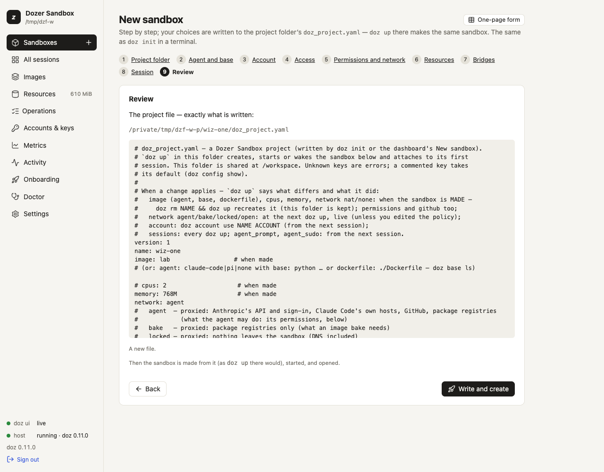

# Projects

A **project** is a folder with a `doz_project.yaml` file in it. The file describes the folder's
sandbox — which agent, how much memory, what it may reach, which sessions to start — and `doz up` in
that folder creates, starts or wakes exactly that sandbox, with the folder shared at `/workspace`.
Use projects when you work on the same code day after day, or want everyone on a team to get the same
sandbox from a checkout.

## Concepts

- **The folder is the workspace.** A project's sandbox always shares its own folder at `/workspace`,
  live: what the agent writes is on your Mac at once, and the other way round.
- **The file holds choices, never secrets.** You can commit it. Credentials come from your
  [accounts](09-agents-and-accounts.md), which stay on your Mac.
- **Some choices are made when the sandbox is made.** Its image, CPUs and memory — and a `nat` or
  `none` network — are the virtual machine's make-up. Changing them in the file affects a **new**
  sandbox only; `doz up` tells you so. Other keys apply at once or from the next session (below).
- **Your projects folder is not a project.** The setting `defaults.projects_dir`
  (`~/dozer-sandbox-workspaces`) is where **Quick add**, **New sandbox** and `doz new` make a
  folder for each new sandbox that has none of its own — `claude-sandbox`, `claude-sandbox-2`, … —
  with no `doz_project.yaml`. Run `doz init` in one of them to make it a project. Change the folder in
  **Settings** › **Choose…** or with `doz config set defaults.projects_dir DIR`
  ([The quickest way](05-sandboxes-and-lifecycle.md#the-quickest-way-quick-add-and-doz-new)).

## Make a folder a project

```sh
cd ~/code/my-app
doz init
```

On a terminal `doz init` walks the same steps as the dashboard's **New sandbox** wizard, each saying
`Step N of 10`:

1. **Project folder** — the folder, and the sandbox's name (suggested from the folder's);
2. **Agent and base** — the image (suggested from the setting `defaults.image`);
3. **Account** — for an agent: `default` (the store's), `none`, or an account;
4. **Access** — the same questions as onboarding's Access step, for this sandbox: GitHub as you (`off`,
   `read` or `push`; the default is the setting `defaults.github`) and SSH agent forwarding. What you
   turn on is confirmed live (as `doz access` does); one that can't be confirmed can be skipped — kept,
   not confirmed — turned off, or checked again. Where the GitHub token comes from is this Mac's choice
   (`doz access set`), not the project's;
5. **Workspace rules** — onboarding's description of `.dozignore` and `.dozreadonly`, what the folder
   already has (each rule file, how many patterns and its first lines — or *none — the folder is shared
   as is*, with how to add one), and this sandbox's choice: **Lock** or **Hide** (`ignore_mode` in the
   file; the default is the setting `workspace.ignore_mode`). See [Workspace rules](20-workspace-rules.md);
6. **Permissions and network** — the network, and what the agent may do (`standard`, `locked`,
   `open`, or changes like `+web,-error-reports`);
7. **Resources** — CPUs and memory (the disk is the image's own; it isn't set per sandbox);
8. **Bridges** — the clipboard, links in your browser, workspace files opened on the Mac;
9. **Session** — tmux, and the agent's sudo;
10. **Review** — the file it will write, and **Write?**

Each question shows its default; **Enter** keeps it. It sets this Mac up first if it never was. The
file lists every key: what you chose is set, and what you left at its default stays commented out — it
follows your settings.

In a folder that already has a project file, `doz init` on a terminal starts from that file, and
replaces it only after showing what changes (`- ` the line there now, `+ ` the new one) and asking.

```sh
doz init ~/code/other --name other --image python-claude-code --memory 4G --yes
doz init ~/code/api --yes --network agent --permissions +web --github read --tmux
doz init --force            # rewrite an existing doz_project.yaml without asking
```

| option | what it does |
|---|---|
| `DIR` | The folder (default: the current one; made if missing). |
| `--name` · `--image` · `--cpus` · `--memory` · `--network` · `--permissions` · `--account` | Answer those questions up front. |
| `--github` · `--ssh-agent` · `--ignore-mode` · `--clipboard` · `--browser-bridge` · `--open-files` · `--tmux` · `--agent-sudo` | The same, for access, workspace rules, bridges and the session (`--no-tmux`, `--no-agent-sudo` too). |
| `--yes` | Ask nothing: every default. `--json` and no terminal ask nothing too. |
| `--force` | Rewrite an existing file without asking. |

## Use it

```sh
cd ~/code/my-app
doz up
```

With no sandbox name, in a project folder, `doz up`:

1. creates the sandbox if it doesn't exist (the folder becomes its `/workspace`);
2. starts it, or wakes it;
3. starts the file's `sessions` — the first one attached to your terminal, the others in the
   background;
4. brings the sandbox's own settings into line with the file (its agent prompt, sudo, clipboard,
   browser bridge, opening files, tmux), and says what it changed.

Options you give `up` win over the file's, for a new sandbox: `doz up --memory 8G`.
`doz up -d` does it all without attaching. When you detach (**Ctrl-]** twice), the line printed
names the shortest way back — in the project folder that is just `doz up`.

### In the dashboard

**Sandboxes** › **New sandbox** is a wizard with the same ten steps, in a window over the dashboard. It starts with the **project
folder**: a new folder in your projects folder, or a folder you have (type it, or **Choose…** in your
Mac's folder picker). If that folder has a project file, the wizard starts from it.

- Every step is filled in from your settings (or from the file). The steps run across the top, a
  check on each one done (hover it for your answer) — click one to go back to it. **Back** and **Next**
  (at the bottom, always in view) move between steps, **Enter** is Next, **Alt+←** / **Alt+→** too, and
  **Skip to review** jumps to the end keeping every default.
- **✕** or **Escape** closes the wizard; once you have chosen something it asks first. The browser's
  **Back** closes it too and keeps your choices — **Forward**, or **New sandbox** again, picks up where
  you were.
- **Workspace rules** lists the folder's `.dozignore` / `.dozreadonly` as they are now; add or edit one on
  the Mac and press **Look again**.
- **Review** lists your choices and says what will happen; **The file, exactly as written** unfolds the
  `doz_project.yaml` it will write. **Write and create** writes it into the folder, makes the sandbox
  from it — as `doz up` there would — starts it, sets up its tools and opens its page. A folder that
  already has a file asks first, showing what changes.
- **One-page form** (top right) is the old single form, for an isolated sandbox with no project file.
  **Quick add** stays the no-questions way in ([The quickest way](05-sandboxes-and-lifecycle.md#the-quickest-way-quick-add-and-doz-new)).



A project's sandbox is an ordinary sandbox there: it appears under **Sandboxes**, and its page shows
its workspace folder.

## `doz_project.yaml` reference

The file may also be called `doz_project.yml`. A folder with both is an error — `doz up`, `doz init`
and the dashboard all say so; keep one.

```yaml
version: 1
name: webapp                # the sandbox
image: claude-code          # or: agent + base, or agent + dockerfile (below)
cpus: 4
memory: 4G
network: agent              # agent, bake, locked, open, nat, none
permissions: "+web"         # standard, locked, open, or changes on Standard
account: default            # default, none, or an account name
sessions:                   # what doz up starts; the first is attached
  - claude                  #   the image's own session
  - name: server            #   a session of your own
    command: npm run dev    #   split on spaces, no shell — or a list: [npm, run, dev]
agent_prompt: |             # this project's own lines for the agent
  The tests run with `make test`.
agent_prompt_mode: append   # or replace
agent_sudo: true
clipboard: write            # or off
browser_bridge: on          # or off
open_files: on              # or off
ssh_agent: off              # or on
github: off                 # read or push: git and gh signed in as you
tmux: false                 # or true
workspace_view: on          # off: share the folder directly (programs in it lose their folder at a wake)
```

| key | value | default | when a change applies |
|---|---|---|---|
| `version` | `1` | — | — |
| `name` | the sandbox: 1–40 of `a-z 0-9 -` | the folder's name | — |
| `image` | `claude-code`, `pi`, `lab`, a base × agent image (`python-claude-code`, `go-pi`, `debian`, …) or a template | `defaults.image` | when the sandbox is made |
| `agent` | `claude-code`, `pi` or `none` — instead of `image`, with `base` or `dockerfile` | `claude-code` | when made |
| `base` | a recommended base: `node`, `python`, `go`, `rust`, `java`, `ruby`, `dotnet`, `debian`, `ubuntu`, `alpine` | `node` | when made |
| `dockerfile` | your own Dockerfile, relative to the folder or absolute (see [Images and bases](08-images-and-bases.md#your-own-dockerfile)) | — | when made |
| `cpus` | 1–64 | `defaults.cpus` (2) | when made |
| `memory` | `2G`, `512M` or MiB, 256 MiB – 256 GiB | per image (settings) | when made |
| `network` | `agent`, `bake`, `locked`, `open`, `nat`, `none` | per image | `agent`/`bake`/`locked`/`open`: at the next `doz up`, live (unless you edited the sandbox's permissions since); `nat`/`none`: when made |
| `permissions` | what the agent may do on a network with permissions (`agent`, `locked`, `open`): `standard`, `locked`, `open`, or changes on Standard like `+web,-error-reports` (or a list); see [What the agent can do](10-permissions-and-network.md) | `defaults.permissions` (standard) | when made (later: `doz net allow` / `doz net deny`) |
| `account` | `default`, `none` or an account name | follow the store's default | run `doz account use NAME ACCOUNT` |
| `sessions` | a list of session names, or `{name, command}` — at most 16 | the image's own session | every `doz up` |
| `agent_prompt` | text, at most 16 KiB | — | the next session |
| `agent_prompt_mode` | `append` or `replace` | `append` | the next session |
| `agent_sudo` | `true` or `false` | `sandbox.agent_sudo` (true) | the next session |
| `clipboard` | `write` or `off` | `sandbox.clipboard` (write) | at once |
| `browser_bridge` | `on` or `off` | `sandbox.browser_bridge` (on) | at once |
| `open_files` | `on` or `off` | `sandbox.open_files` (on) | at once |
| `ssh_agent` | `on` or `off` | `sandbox.ssh_agent` (off) | at once |
| `github` | `off`, `read` or `push` ([GitHub as you](18-github.md)) | off | when made (later: `doz net allow NAME github:as-you`) |
| `tmux` | `true` or `false` | `sessions.tmux` (false) | the next session |

The schema is closed: an unknown key, a key given twice, a wrong type or a value out of range is an
error that names the line. One YAML document, no anchors or aliases, at most 64 KiB.

### When you change the file

`doz up` compares the file with the sandbox and says each difference and what it did, for example:

```
[doz] cpus 2 → 4 in doz_project.yaml: applies only when the sandbox is made — doz rm webapp && doz up recreates it (this folder is kept)
[doz] network agent → locked in doz_project.yaml: applied now (live — the next connection is judged by it)
[doz] clipboard off in doz_project.yaml — applies at once (the UI re-reads it)
```

To remake a sandbox with new make-up, `doz rm NAME` then `doz up`. Your folder is never touched; the
agent's history on the sandbox's state disk goes with the sandbox, so take a
[duplicate](12-restore-points-duplicates-templates.md) with `--copy-state` first if you want to keep it.

## Limits

- One sandbox per project file. Several folders can each have their own.
- The sandbox's name must be unique in the store. Two checkouts of the same project on one Mac need
  different `name`s.
- `permissions` and `github` need a network with permissions (`agent`, `locked` or `open` — or an image
  whose default network is one): with `bake`, `nat` or `none` the file is refused, and says why.
- The disk is the image's own: there is no disk-size key.

## Troubleshooting

| symptom | what to do |
|---|---|
| "unknown key …" | The key isn't in the table above (check its spelling). |
| `doz up` says "which sandbox?" | There's no `doz_project.yaml` in this folder: `cd` into the project, or `doz init`. |
| "NAME was made from …, not this folder's doz_project.yaml — using it anyway" | Two projects use the same `name`, so they share one sandbox. Rename one. |
| A change in the file didn't apply | `doz up` prints when each change applies; image, CPUs and memory need a new sandbox. |
