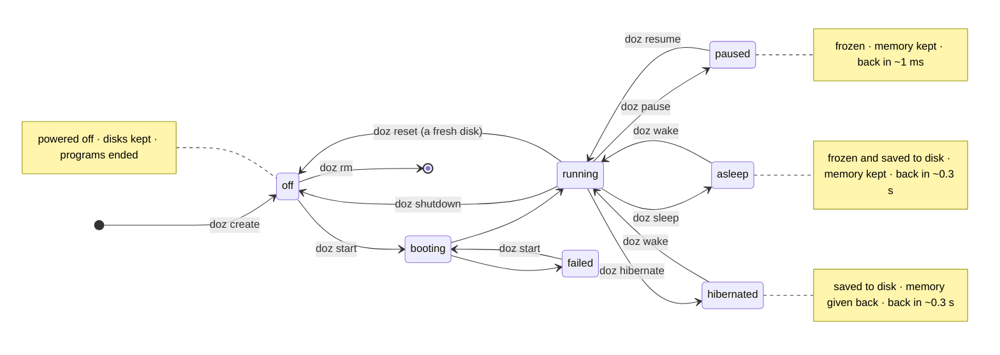
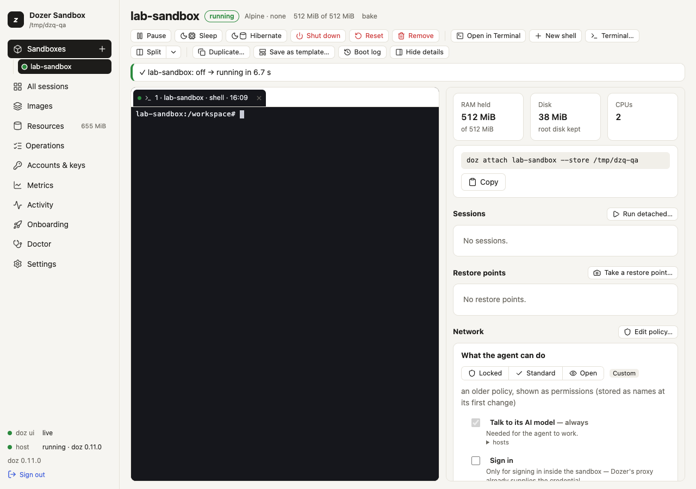
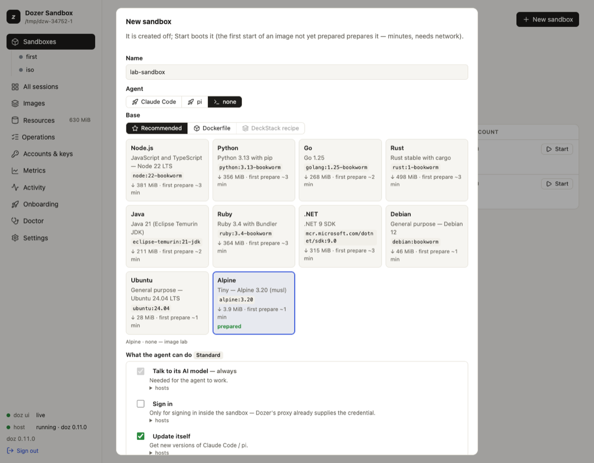
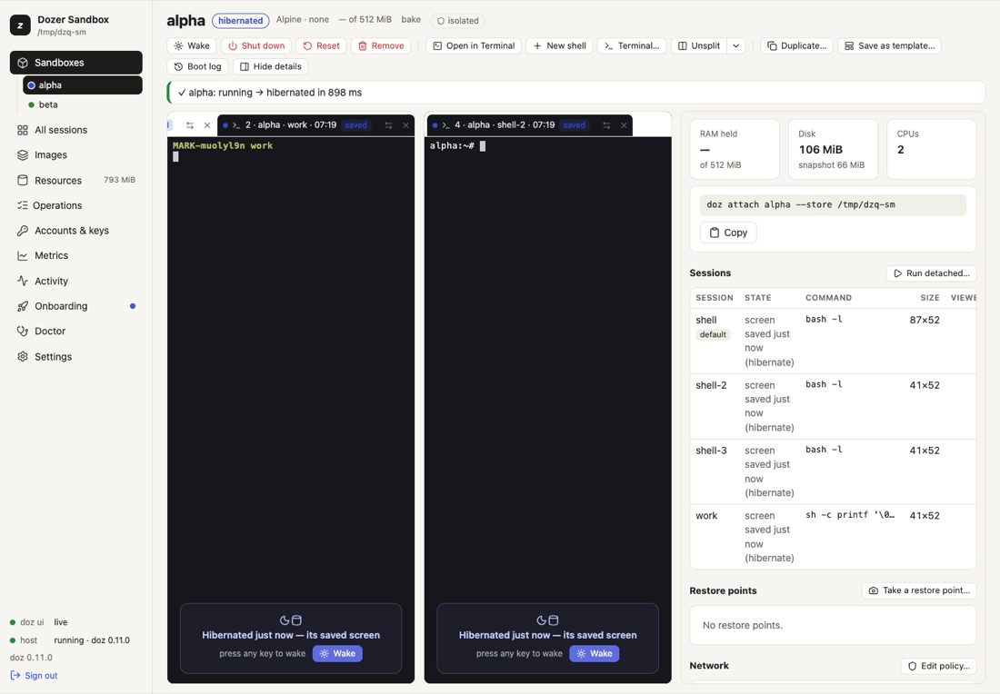
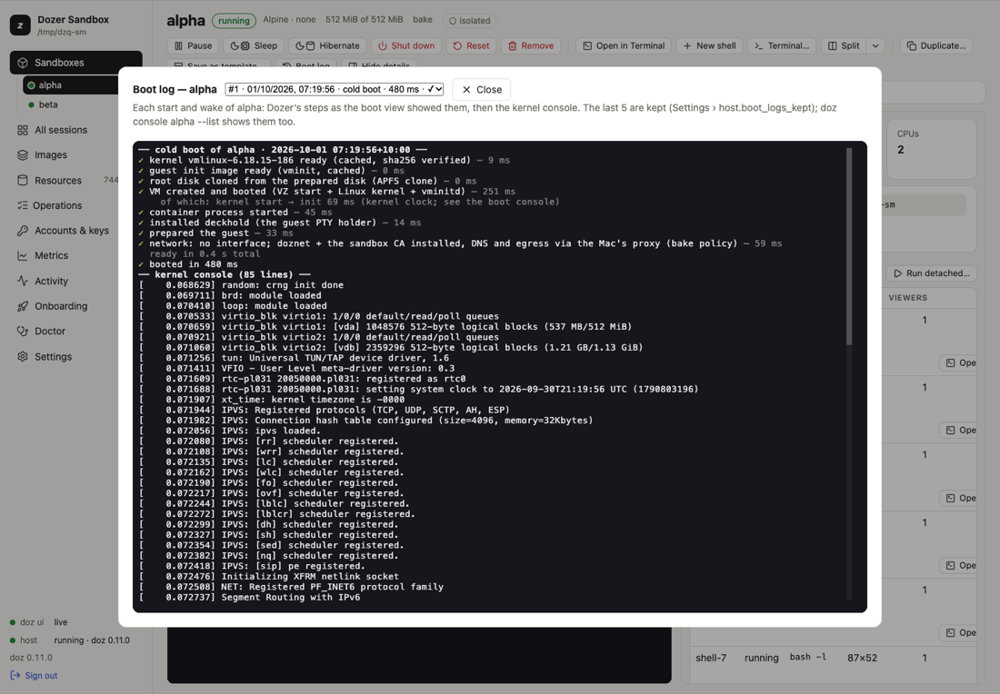

# Sandboxes and their lifecycle

A **sandbox** is one Linux virtual machine with its own disks. This page covers making one, the
states it can be in — running, paused, asleep, hibernated, shut down — and moving between them, and
the background **host** that runs them all.

## Concepts

- **Name.** 1–40 characters of `a-z 0-9 -`, unique in the store.
- **Image.** What the sandbox starts from (Claude Code, pi, a plain shell, a template…). See
  [Images and bases](08-images-and-bases.md).
- **Three kinds of storage**, each kept differently:

  | | what's on it | kept through |
  |---|---|---|
  | the **root disk** | the system and anything installed or written outside the next two | shutdown; gone with `reset` (back to the image) and `rm` |
  | the **state disk** (agent images) | the agent's own settings, logins and history (`~/.claude`, `~/.pi/agent`) | shutdown **and** reset; gone with `rm` |
  | the **workspace** | your Mac folder shared at `/workspace` | everything — it's on your Mac |

- **Isolated.** A sandbox with no shared folder: `/workspace` is a folder on its own disk, and nothing
  on your Mac is shared. `doz ls` shows `isolated`, and the agent is told.
- **Sessions.** The terminal programs running inside (a shell, `claude`, `pi`). They survive pause,
  sleep and hibernate. See [Terminals and sessions](07-terminals-and-sessions.md).
- **The host.** One background `doz` process per store. It owns every running VM, the network proxy
  and the credentials. The first command that needs it starts it, and it exits when idle, so you
  normally never think about it.

## The states



`doz ls` and the dashboard show which of these states each sandbox is in. `doz up` also wakes an
asleep or hibernated sandbox and resumes a paused one, so it's the one command to remember.

| command | what happens | typical time | memory | programs |
|---|---|---|---|---|
| `doz start NAME` | boots (or wakes it if asleep, resumes it if paused) | ~0.4 s (a first start may prepare the image) | used as needed | start fresh |
| `doz pause NAME` · `doz resume NAME` | the CPU stops | ~1 ms | kept | frozen, then carry on |
| `doz sleep NAME` · `doz wake NAME` | paused **and** saved to disk — survives a crash of the host | ~0.3 s | kept | carry on |
| `doz hibernate NAME` · `doz wake NAME` | saved to disk, then the VM stops | ~0.35 s / ~0.3 s | **given back** | carry on: same processes, same screens |
| `doz shutdown NAME` | a cold stop; the disks are kept | | given back | end |
| `doz reset NAME` | shut down and go back to a fresh copy of the image (the state disk and restore points stay) | | | end |
| `doz rm NAME` | remove the sandbox and everything it has on disk | | | end |

`start` has an alias, `cold-boot`; `pause` has `suspend`.

`shutdown`, `reset` and `rm` ask first. `--yes` skips the question; without a terminal and without
`--yes` they refuse, so a script can't destroy something by accident. The question names what you
asked for — and checks it exists — before you answer.

A program started less than three seconds before a hibernate gets the rest of those three seconds
first, so a program in the middle of starting up isn't frozen at a bad moment.

## The quickest way: Quick add and `doz new`

One click in the dashboard, or one command, makes a sandbox with every default and puts you in it:

- the image is the setting `defaults.image` (onboarding sets it to the image you chose);
- the name is the image's — `claude-sandbox`, `pi-sandbox`, `lab-sandbox` — or the next free one
  (`claude-sandbox-2`, …) when a sandbox has that name, or its folder already has something in it;
- its workspace is a folder of its own in your **projects folder**, the setting
  `defaults.projects_dir` (`~/Developer/dozer-sandbox-projects` unless you change it):
  `~/Developer/dozer-sandbox-projects/claude-sandbox`, made for it;
- the account and what the agent can do are the defaults.

**In the dashboard**, **Sandboxes** › **Quick add** (or the **+** beside **Sandboxes** in the
sidebar). The sandbox is made and started at once; its page opens with the boot in a terminal, which
then becomes the sandbox's own session. A note says what it chose.



**In a terminal**:

```sh
doz new
```

It prints what it chose — `claude-sandbox-2 · claude-code · ~/Developer/dozer-sandbox-projects/claude-sandbox-2`
— then creates it, starts it and attaches you to its session (**Ctrl-]** twice detaches; it keeps
running). Each option changes just that one thing:

| option | what it does |
|---|---|
| `--image` | Another image than `defaults.image`. |
| `--name` | Your own name (refused if a sandbox has it). |
| `--isolated` | Share no folder. |
| `-d` · `--detach` | Create and start it, but don't attach. |
| `--json` | Answer `{name, image, workspace, phase, session, milliseconds}` instead of attaching. |

**When one click can't decide.** Some things need your choice first: pi needs an Anthropic API key,
and an image an older doz prepared can be used as it is or rebuilt. Then **Quick add** opens the
**New sandbox** form instead — filled in with its choices, and the requirement said at the top — and
`doz new` asks on a terminal, as `doz create` does (off a terminal it says what to do and makes
nothing). `doz new` uses the store's default account: `doz account default NAME` makes an API-key
account the default.

**The projects folder.** Change it in **Settings** › **New sandboxes** › `projects_dir` ›
**Choose…** (your Mac's own folder picker), or `doz config set defaults.projects_dir ~/code/sandboxes`.
New sandboxes from Quick add, **New sandbox** and `doz new` use it; existing ones keep their folders.

## Create and start — in the terminal

```sh
doz create my-box --image lab --isolated            # made, and off
doz start my-box
doz create my-app --image claude-code --workspace ~/code/my-app --start
doz create my-pi --image pi --workspace ~/code/my-pi --prepare   # made and off, its image ready
doz up my-app                                        # create if missing, start or wake, attach
```

| option | what it does |
|---|---|
| `--image` | `lab`, `claude-code`, `pi`, a base × agent image, or a template. Or `--agent` with `--base` / `--dockerfile` ([Images and bases](08-images-and-bases.md)). |
| `--workspace DIR` | Share this Mac folder at `/workspace`. Made if it doesn't exist; refused for your home folder itself, system locations and the store. |
| `--isolated` | Share nothing (the default without `--workspace`; this says it on purpose). |
| `--cpus` · `--memory` | Virtual CPUs (default 2) · RAM (`2G`, `512M`; default 1 GiB for lab, 2 GiB for an agent image). |
| `--network` · `--allow` | What the agent may reach ([What the agent can do](10-permissions-and-network.md)). |
| `--account` | Which Claude account it uses ([Agents and accounts](09-agents-and-accounts.md)). |
| `--start` | Start it straight away. |
| `--prepare` | Prepare its image now — download and bake it once, with its progress — so the first start does not wait; the sandbox stays off. If that image is already being prepared, it joins that preparation. Ctrl-C stops watching; the preparation goes on (`doz onboard --status` follows it). |
| `--rebuild` · `--use-current` | When the image is out of date: rebuild it first, or use it as it is. |

`doz up` is the everyday command, like `vagrant up` or `docker compose up`: create if missing, start
or wake, then attach to the image's own session (`claude`, `pi`, or a shell called `shell`). `-d`
does all that without attaching. On an existing sandbox, create options are ignored (it says so).

## Create and start — in the dashboard

1. **Sandboxes** › **New sandbox** — a wizard, step by step: the **project folder** (a new one in
   your projects folder, or one you have), the **Agent** and the **Base** (or a **Template**), the
   account, access (GitHub, SSH agent), what the agent can do, CPUs and memory, the bridges, and the
   session. Each step is filled in from your settings; **Skip to review** keeps the rest.
2. **Review** shows the `doz_project.yaml` it writes into the folder; **Write and create** writes it,
   makes the sandbox from it, starts it and opens it with the boot in a terminal. See
   [Projects](04-projects.md#in-the-dashboard).
3. Or **One-page form** (in the wizard, top right): everything on one page, a **Shared folder** or
   **Isolated**, and no project file. **Create** makes it off; **Start** boots it. With the setting
   `ui.boot_view_on_start` on (the default), Start opens a terminal that shows the boot as it happens,
   then becomes the sandbox's own session.



Each sandbox has an entry under **Sandboxes** in the sidebar, with a dot in its state's colour (filled
while it holds memory, a ring when it holds none, a square when it failed). Its page has the lifecycle
buttons across the top — **Start**, **Pause**, **Resume**, **Sleep**, **Hibernate**, **Wake**, **Shut
down** — showing only those that make sense in its state, the one that brings it back first;
**Reset…** and **Remove…** are under **⋯**. **Reset** and **Remove** ask you to type the sandbox's
name; **Shut down** asks with a plain confirmation ("Don't ask again" sets `ui.confirm_shutdown` to
`false`).

## See what you have

```sh
doz ls                  # every sandbox: image, state, RAM held, disk, sessions, network
doz inspect my-app      # everything about one, as JSON
doz sessions my-app     # its terminal sessions
```

**RAM held** is what the VM costs your Mac right now: its allocation, less what it handed back after
a wake. It shows `—` for a sandbox that is off or hibernated. Looking never starts a host: with none
running, these commands read the store directly.

## Saved screens

Before a sandbox pauses, sleeps or hibernates, Dozer saves the screen of each of its sessions — and
every `host.screen_capture_minutes` (5) while it runs, for sessions that printed something since. So
you can see what a sleeping sandbox was doing without waking it:

```sh
doz sessions my-app                     # listed from their saved screens while it sleeps
doz sessions my-app --screen claude     # that session's last screen, as text
```

In the dashboard, a sleeping sandbox's page shows each session's saved screen, read-only (you can
select and copy from it), with "press any key to wake". Saved screens exist only while you can wake
the sandbox: shutdown, reset and remove delete them.



## Boot logs

Every boot of a sandbox — each start, each wake, a recovery after a crash — is kept: Dozer's timed
steps as the boot view showed them, and the Linux kernel's own messages.

```sh
doz console my-app --list               # the kept boots: when, what, how long, ✓ or ✕
doz console my-app --steps              # the latest boot's steps, then its kernel console
doz console my-app --boot 2             # the one before
doz console my-app --follow             # watch the console live as it boots
```

In the dashboard: **⋯** › **Boot log** on the sandbox's page (it works in any state; nothing is woken).



## The host

```sh
doz host status          # is one running, and what does it hold? (never starts one)
doz host stop            # hibernate everything that runs, then stop the host
doz events               # follow what the host does, live (Ctrl-C stops)
doz events my-app        # only this sandbox
```

- **Idle exit.** The host exits after `host.idle_timeout_minutes` (5) with nothing running, paused
  or asleep and nobody attached. The next command starts a new one.
- **`doz host stop`** shows each sandbox as it hibernates, then a summary. Everything wakes on the
  next `wake`, `attach`, `up` or `exec`, sessions and all.
- **If the host crashes**, the next command starts a new one. Sleeping sandboxes come back with their
  sessions; hibernated ones are untouched. Ones that were running are marked as having died with the
  host (`doz ls`), and their disk is checked at the next start.
- **Logs** are in `<store>/host.log`. `doz metrics` shows how long each kind of action takes.

## Time zone

A sandbox follows your Mac's time zone, read again at every start and wake — so a sandbox that slept
while you travelled wakes in your new zone. The agent is told its time zone too. To pin one:
`doz config set sandbox.timezone Australia/Sydney`.

The rest of Dozer's set-up inside the sandbox is put back at every start and wake too: apt never
stops to ask a question, the sandbox's own name resolves, the agent's sudo follows its setting, and
links open on your Mac. So a sandbox that only ever sleeps or hibernates and wakes still gets what a
newer doz fixes, without a restart.

## Settings

| key | default | what it does |
|---|---|---|
| `defaults.cpus` | `2` | CPUs of a new sandbox (`--cpus`). |
| `images.lab.memory_mib` · `images.claude-code.memory_mib` · `images.pi.memory_mib` | `1024` · `2048` · `2048` | Memory of a new sandbox of each image (`--memory`); other images follow the one they're based on. |
| `defaults.projects_dir` | `~/Developer/dozer-sandbox-projects` | Your projects folder: where Quick add, `doz new` and the dashboard's New sandbox make a new sandbox's own folder (`<projects_dir>/NAME`). **Settings** › **Choose…** picks it. |
| `sandbox.timezone` | `mac` | `mac` (follow this Mac) or a zone like `Australia/Sydney`. Applies at each start or wake. |
| `host.idle_timeout_minutes` | `5` | Minutes with nothing running before the host exits; `0` = never (`$DOZ_HOST_IDLE`). |
| `host.screen_capture_minutes` | `5` | How often a running sandbox's changed screens are saved; `0` = only at pause, sleep and hibernate. |
| `host.boot_logs_kept` | `5` | Boots kept per sandbox (1–50). |
| `ui.boot_view_on_start` | `true` | The dashboard's Start opens a terminal on the boot. |
| `ui.confirm_shutdown` | `true` | The dashboard's Shut down asks first. |

## Limits

- Memory is reserved up to the sandbox's allocation while it runs; hibernate gives it all back.
- A snapshot (sleep, hibernate) can't be moved to another Mac: it is encrypted with a key specific
  to this Mac.
- Nothing pauses or sleeps a sandbox by itself yet; you (or a script) decide.

## Troubleshooting

| symptom | what to do |
|---|---|
| The first start is slow | It's preparing the image, once per store. `doz onboard` or `doz image bake NAME` does it ahead of time; `-v` shows the steps. |
| A start or wake failed | `doz console NAME --list`, then `doz console NAME --steps`: the failing step is marked ✕, with why. |
| A wake fails again and again | `doz host stop`, then wake again (a failed wake keeps its snapshot). Last resort: `doz shutdown NAME` then `doz start NAME` — programs end, the disks are kept. For Claude Code, `claude --continue` picks the conversation back up. |
| A sandbox shows as died | The host crashed while it ran. `doz start NAME` checks its disk and boots it. |
| "not possible in this phase" | The action doesn't fit the sandbox's state (e.g. `resume` on one that isn't paused). `doz ls` shows its state. |
