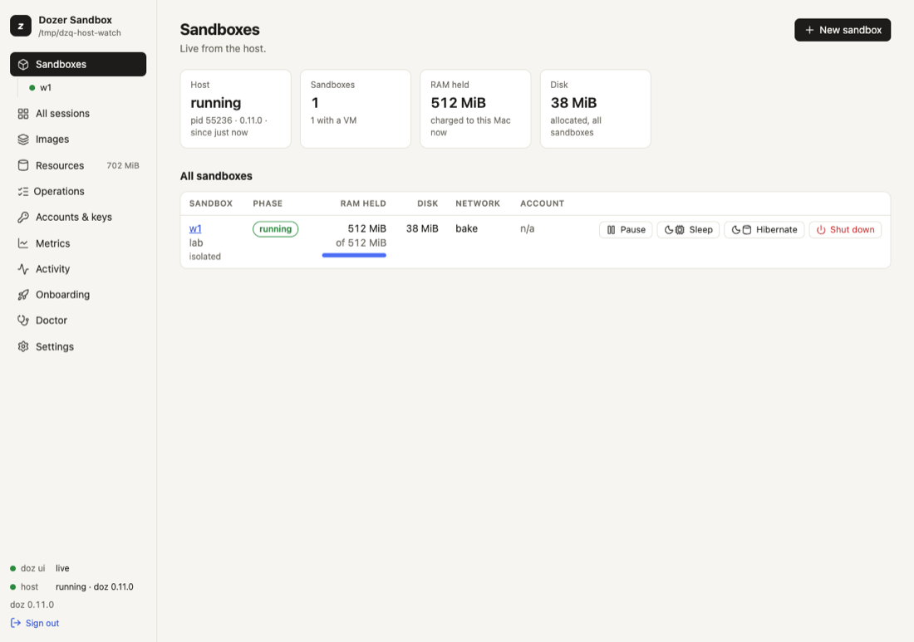
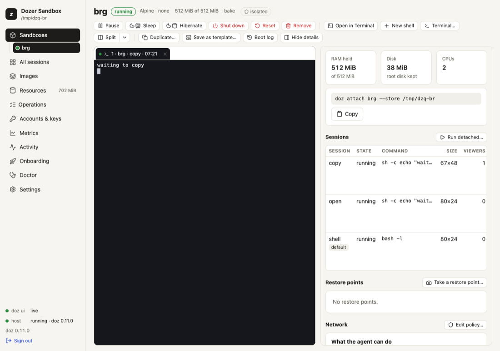
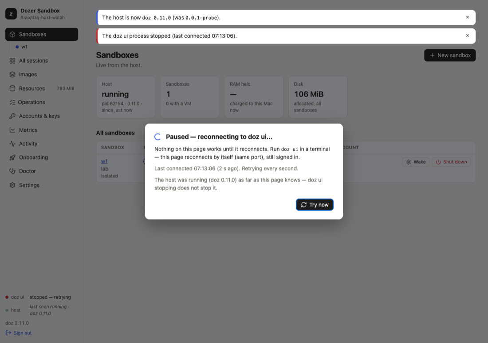

# The dashboard (`doz ui`)

`doz ui` is Dozer in your browser: every sandbox with a live terminal, its restore points and
permissions, your images, accounts, disk use and settings. It does almost everything the command line
does, and a few things are easier there — watching many sessions at once, or seeing what an agent was
refused and allowing it with one click. It runs on your Mac only; nothing else can reach it.

## Concepts

- **One dashboard per store.** Running `doz ui` again reuses the one that runs.
- **A one-use sign-in link.** `doz ui` opens your browser with a link that works **once**, for **five
  minutes**, and signs that browser in — it stays signed in until you sign out or don't use it for
  **14 days** (each visit renews it), so an installed dashboard app opens signed in. Nobody else can sign
  in without a link.
- **An app, if you like.** Install it from Chrome or Safari and it opens in its own window with its own
  icon (see [Install it as an app](#install-it-as-an-app)).
- **A client of the host**, like the command line. Opening the dashboard doesn't start the host;
  any action you take does, as a command would.

## Start it

```sh
doz ui                    # serve it and open it in your browser (the same as doz ui start)
doz ui --print-url        # print the link instead of opening a browser
doz ui link               # another browser or tab on the dashboard that runs
doz ui restart            # restart the running dashboard: open pages carry on by themselves
doz ui --new-link         # sign every page out and make a new link
doz ui --detach           # run it in the background (no terminal needed), open it, and return
doz ui stop               # stop the running dashboard — a detached one, or one in another terminal
```

Stop it with **Ctrl-C** in its terminal, or `doz ui stop` from any terminal. `doz ui --detach` keeps it running
without a terminal (its log is the file ui.log in the store) until `doz ui stop`; `doz ui restart` keeps it in the background. The address is `http://127.0.0.1:PORT` — this Mac only. The
port is the setting `ui.port`: `0` (the default) means the port this store's last dashboard used, when
it's free, so a page left open reconnects by itself — still signed in — when you start `doz ui` again,
and no new tab opens. If another program took that port, `doz ui` says which and listens elsewhere. For
an installed app, fix the port, because an app belongs to one address:

```sh
doz config set ui.port 7443   # then: doz ui restart
doz ui start --port 7444      # one run on another port
```

A fixed port that another program holds is never silently swapped: `doz ui` refuses to start and names
the program. After `doz ui restart` onto a new port, the dashboard opens there in a new tab and the old
page says where it went (a browser rule keeps a page from following by itself).

**When a tab opens:** only when none of the dashboard's pages is open (the setting `ui.open_browser`:
`auto`). Set it to `always` or `never`, or use `--open` / `--no-open` for one run.

Treat a printed link like a password: anyone with it can sign in to your dashboard for those five
minutes.

## Install it as an app

- **Chrome (or Edge):** on the dashboard, the address bar's install icon or **⋮ › Cast, save and share ›
  Install page as app…** — *Install Dozer Sandbox*. It opens in its own window, with the Dozer icon in the
  Dock and in ⌘-Tab, and shares Chrome's sign-in.
- **Safari:** **File › Add to Dock**. A Safari web app keeps its own cookies, so it opens on the
  dashboard's sign-in: paste a link from `doz ui link --print-url` into its field.

When `doz ui` isn't running, the app (or a reload) shows **Dozer isn't running on this Mac** with what to
run, instead of the browser's error page; it comes back by itself, on the view it was on, as soon as
`doz ui` answers. The app needs nothing to stay running in the background.

## The pages



The sidebar groups the pages under four headings — **Sandboxes** (All sandboxes, each sandbox, All
sessions), **Store** (Images, Resources), **Activity** (Operations, Activity, Metrics) and **Setup**
(Accounts & keys, Settings, Doctor, Onboarding). The page you are on is the raised entry. In a window
narrower than about 980 px the sidebar is a column of icons (hover one for its name); the button at its
top shows the whole sidebar over the page.

| page | what it's for |
|---|---|
| **All sandboxes** | Every sandbox: state, RAM held, disk, network, account. Each row has the one likely next action (**Start**, **Resume**, **Wake** or **Pause**) and **⋯** for the state's other actions; click a row to open the sandbox. **Quick add** (every default, started and opened — also the **+** beside the **Sandboxes** heading in the sidebar; see [The quickest way](05-sandboxes-and-lifecycle.md#the-quickest-way-quick-add-and-doz-new)) and **New sandbox** (a wizard: every choice, step by step, written to the project folder's `doz_project.yaml` — see [Projects](04-projects.md#in-the-dashboard)). Under it in the sidebar, each sandbox has its own entry that opens **its page**; its dot is filled while the sandbox holds memory (running, paused, asleep), a ring when it holds none (hibernated, shut down), a square when it failed; a second dot at the right says what its agent is doing (see [What the agent is doing](07-terminals-and-sessions.md#what-the-agent-is-doing)). |
| **A sandbox's page** | See [A sandbox's page](#a-sandboxs-page) below. |
| **All sessions** | A grid of live, read-only tiles: every session of every running sandbox, each with what its agent is doing. Click a tile to open it. |
| **Images** | The images and templates, each image's agent version, what's out of date (**Rebuild** — **Remove…** is under **⋯**), disk shared and own, and the **Lineage** tree. |
| **Resources** | Every byte Dozer uses, and deleting what can go. A strip under the total jumps to each group (with its size); a group's heading folds it. See [Resources and disk space](13-resources-and-disk-space.md). |
| **Operations** | Every action the dashboard (or a preparation) started: live progress, time taken, result. A spinner shows while any runs, and a red dot when one failed since you last looked. |
| **Accounts & keys** | Your Claude accounts: add, verify, make default, remove (under **⋯**), keep-alive. |
| **Metrics** | How long each kind of action takes (count, median, p90…), filtered by image and time; download as CSV. |
| **Activity** | What the host is doing, live. |
| **Onboarding** | The setup wizard, again (in a window over the page, as **New sandbox** is). |
| **Doctor** | `doz doctor`'s checks, with **Run onboarding again**. |
| **Settings** | Every setting, its value, default and description, and where its value came from; change it in place. **Filter** finds a setting by its key (`ui.theme`), its name or a word of its description; the strip under it jumps to a section, **Access** first. Folders on your Mac are never typed here: the projects folder has **Choose…**, your Mac's own folder picker; the others are set with `doz config set`. |

### A sandbox's page



- **The title row**: the name, its state, and labelled facts — **Image**, **RAM**, **Network** (with
  how many connections were refused; click it for the **Network** tab), **Account** — and *isolated*
  or *rules* when they apply.
- **The toolbar**: the state's actions as one group — led, for a sandbox that is shut down, paused,
  asleep or hibernated, by the action that brings it back (**Start**, **Resume**, **Wake**); **Shut
  down** apart, in red; **⋯** for **Duplicate…**, **Save as template…**, **Boot log**, then **Reset…**
  and **Remove…**. At its right: what is under way (or how the last action ended), and the button that
  shows or hides the details.
- **The terminals**, whose tab strip carries what makes or arranges them: **New shell** (its **▾**:
  **Terminal…**, **Run detached…**), **Split** (its **▾** picks what a split adds) and **Open in
  Terminal**.
- **The details**, beside them in tabs: **Overview** (RAM, disk, CPUs, the attach command, the
  workspace and its rules, its sessions and last restore point), **Sessions**, **Points** (restore
  points), **Network** (**What the agent can do**, the rules, the connection log), **Keys** (keys and
  account) and **Config** (its configuration and the agent's environment prompt). The tab you chose is
  kept for each sandbox while the page is open; drag the details' left edge to widen them (320–560 px).
  Below about 760 px they move under the terminals.

### Safety catches

**Reset**, **Remove**, **Revert** and every delete ask you to type the name first. **Shut down**
asks with a plain confirmation. Clicking an action again while it runs does nothing more.

### When something fails

A failure is said where you started it, and stays until you dismiss it or it is put right: in the
dialog (which stays open), on the sandbox's toolbar or its row on **All sandboxes**, in the step of a
wizard, in the setting's row — or, when it has no place on the page you are on, at the top of the page.
The brief messages at the bottom right only ever say that something worked. **Operations** keeps
every action's result either way.

### Keyboard

Every control shows a ring when it has the keyboard's focus. Arrow keys move within tabs, segmented
choices and menus; **Escape** closes a menu or a dialog. Three page shortcuts: **g** then **s** opens
**All sandboxes**, **/** the Settings filter, **?** the list of shortcuts. None of them works while a
terminal has the focus — there every key is the terminal's.

## The host, watched

The sidebar's footer shows the dashboard's connection and the host's state and version.

- **The host stopped** (`doz host stop`, idle, or a clean quit): a banner says your sandboxes were
  hibernated, with **Start host**.
- **The host crashed or was killed:** a banner names the sandboxes that were running (they are shut
  down; start them again).
- **Another version of the host took over:** a banner says so. If the host is **older** than the
  dashboard, **Restart host** asks first, hibernates what runs and starts the newer host (sandboxes
  wake when you use them). If the dashboard is the older one, restart `doz ui`.

## When `doz ui` restarts or stops

A restart is routine — an upgrade, `doz ui restart`, the Mac waking up. For the first seconds the page
says, calmly, **Reconnecting to Dozer…**; nothing behind it can be clicked meanwhile. When `doz ui`
answers again the page carries on where it was, still signed in, with no reload:

- **Terminals reattach by themselves**, with their screens (what you typed while it was away is
  dropped, never typed later). An open **New sandbox** wizard keeps its choices.
- **An operation that was running** (a start, a wake) ends with what happened — the host carried it
  on — "finished while doz ui restarted", never a spinner that never stops.
- **A newer doz ui** (after `brew upgrade doz` and a restart): a banner says *Dozer was updated* with
  **Reload**; the page reloads by itself as soon as nothing would be lost (no wizard or dialog open, no
  terminal you're typing in, nothing typed in a field).

If `doz ui` was stopped (Ctrl-C), or doesn't come back within 15 seconds, the overlay says what to run,
when it was last connected and whether the host was running, with **Try now**; after a minute it adds
the port the page expected. The page retries every second and comes back by itself when you start
`doz ui` again (it says "doz ui restarted").



**When the page must sign in again** — after `doz ui --new-link` / `doz ui link --rotate`, after 14 days
unused, or when you signed out — it says why and asks for a link **inside the page**: paste one from
`doz ui link --print-url` (or open one with `doz ui link`). Everything on the page stays as it was while
you sign in; its terminals reattach afterwards.

## Terminals in the browser

On a sandbox's page, a session's **Open** (in the empty terminal area, or the details' **Sessions** tab)
attaches to it and **Watch** (its **⋯**) shows it read-only; on the terminals' tab strip **New shell**
starts a new shell (`shell-2`, `shell-3`, …) and its **▾** › **Terminal…** starts a new session — a shell
or one running a command. Terminals are tabs; **Split** shows two side by side. Closing a tab only closes the
view — the session keeps running. Each tab is titled like `1 · my-app · claude · 14:05` (the setting
`ui.terminal_title`). Details, including the mouse, paste and the clipboard, in
[Terminals and sessions](07-terminals-and-sessions.md#in-the-browser).

**Open in Terminal** opens the same session in your terminal app instead, via `doz attach`.

## Keys in the browser

With `ui.allow_secret_entry` on (the default), the wizard and **Accounts & keys** take an API key or
setup token in a masked field, sent once and stored exactly as `doz account add` stores it. A
sandbox's page can take a key of its own the same way. The dashboard never shows a secret: accounts
and keys appear as a state, a source and a fingerprint. Turn it off with
`doz config set ui.allow_secret_entry false` — the pages then show the commands instead. The
dashboard can switch this off but never on.

## Settings

| key | default | what it does |
|---|---|---|
| `ui.open_browser` | `auto` | When `doz ui` opens a tab: `auto` (only when no page is open), `always`, `never`. |
| `ui.port` | `0` | The port on 127.0.0.1: `0` = the last one when free, or a fixed port 1024–65535 (for an installed app). |
| `ui.theme` | `auto` | `auto` follows macOS; `light`; `dark`. |
| `ui.terminals` | `true` | Terminals in the browser. `false`: none open (Open in Terminal still works). |
| `ui.terminal_font_size` | `13` | Font size of a browser terminal (9–32). |
| `ui.terminal_title` | `{sandbox} · {session} · {time}` | A terminal tab's title (and your terminal's, in `doz attach`). |
| `ui.split_default` | `shell` | What **Split** opens: `shell`, `watch`, `attach` or `dialog`. |
| `ui.details_open` | `true` | A sandbox's page shows its details (the tabs beside its terminals). |
| `ui.boot_view_on_start` | `true` | **Start** opens a terminal on the boot. |
| `ui.confirm_shutdown` | `true` | **Shut down** asks first. |
| `ui.grid_live_tiles` | `8` | All sessions: at most this many tiles live at once (1–12). |
| `ui.grid_tile_size` | `medium` | All sessions: `small`, `medium`, `large`. |
| `ui.progress` | `animated` | How starts and preparations show their progress: `animated` or `plain`. |
| `ui.allow_secret_entry` | `true` | The dashboard may take a key or token (see above). |

## Limits and security

- **Loopback only**, and every page, request and terminal checks the sign-in cookie, the exact host
  and origin, and a CSRF token on every change. For the dashboard on your other computers, tablets and phones,
  see [`doz serve`](25-doz-serve.md).
- **Terminals run in an isolated frame**: whatever a sandbox prints can never reach your dashboard
  session, its cookie or other terminals. Links in terminal output aren't clickable.
- The dashboard alone never keeps an idle host running; an open terminal does, as `doz attach` does.

## Troubleshooting

| symptom | what to do |
|---|---|
| "Sign in with a new link" | The link was used, expired, or every page was signed out: paste a link from `doz ui link --print-url`, or open one with `doz ui link`. |
| A terminal says "Disconnected" | It was silent a long time, or it could not reattach: **Reconnect**. (After a restart or a sign-in it reattaches by itself.) |
| "Dozer moved to 127.0.0.1:…" | `ui.port` changed and `doz ui` restarted there: use the tab it opened (an installed app: install it again from there). |
| The installed app shows "Dozer isn't running" | Start `doz ui`; the window comes back by itself. |
| "ui.port is …, and … listens on 127.0.0.1:…" | Another program holds the fixed port: stop it, or `doz config set ui.port N` (`0` = automatic). |
| Two tabs open each time | Set `ui.open_browser` to `auto` (the default) or run `doz ui --no-open`. |
| Open in Terminal does nothing | Make a terminal app the handler for `.command` files: Finder › Get Info on any `.command` file › Open with › Change All… |
| "the resources are missing" | Reinstall: `brew reinstall doz`. |
