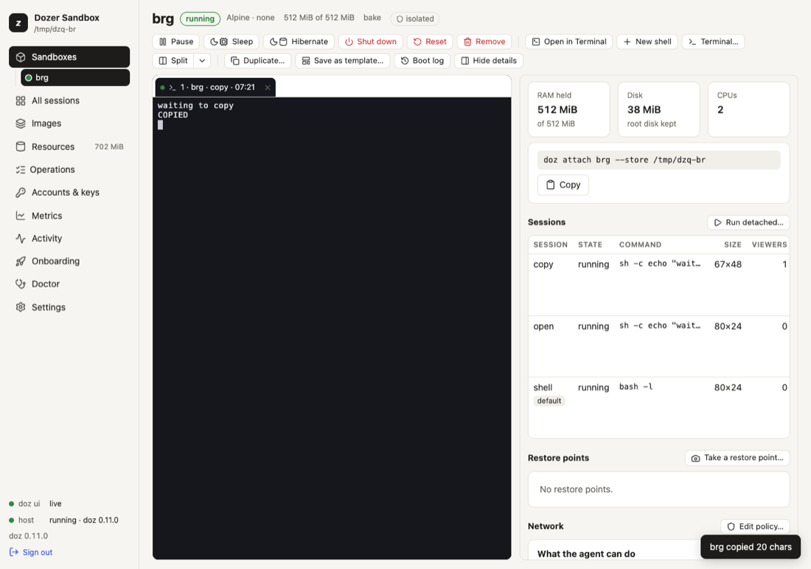
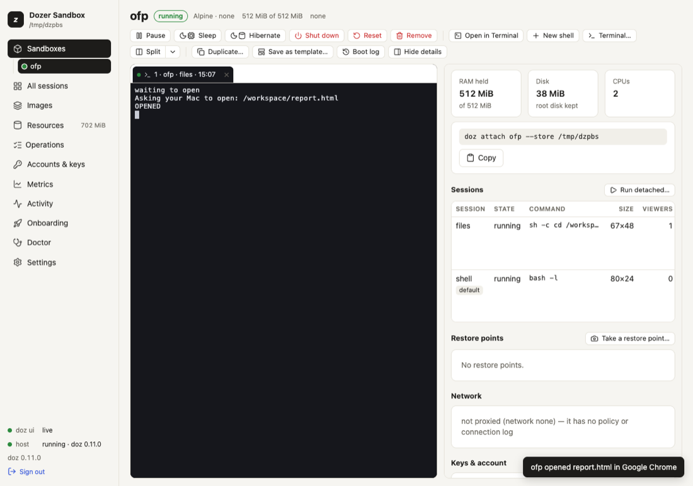

# Terminals and sessions

A **session** is a terminal program running inside a sandbox: a shell, `claude`, `pi`, a dev server.
Sessions live in the sandbox, not in your terminal: you **attach** to one, **detach**, come back
later from another terminal or the browser, and it keeps running the whole time — even while the
sandbox sleeps or hibernates.

## Concepts

- **The image's own session** is called `claude`, `pi` or `shell` (a login shell) depending on the
  image. `doz up` and `doz attach NAME` use it.
- **Several people or windows can view one session.** What's typed in either shows in both.
- **The screen is kept inside the sandbox**, so attaching from anywhere shows the current screen at
  once, redrawn for your window's size.
- **Bridges.** A session's terminal is also how a program reaches your Mac for two things: copying to
  your clipboard, and opening a web page in your browser. Both are shown to you every time and can be
  turned off. See [the clipboard](#the-clipboard) below and
  [Signing in from a sandbox](11-signing-in-from-a-sandbox.md).
- **The agent says what it is doing.** Claude Code and pi tell Dozer when they are working, waiting
  for you or done, and the dashboard and `doz ls` show it. See
  [what the agent is doing](#what-the-agent-is-doing).

## In the terminal

```sh
doz attach my-app                 # the sandbox's own session
doz attach my-app server          # a session by name
doz run my-app -- htop            # a NEW session running a program, attached
doz run my-app -d --session worker -- bash -lc 'make watch'    # start one in the background
doz sessions my-app               # list them
doz sessions restart my-app codex # end its program and start it again (an agent continues its conversation)
doz sessions end my-app worker    # end its program
doz exec my-app -- ls /workspace  # a one-off command: no terminal, output and exit code pass through
```

- `run` starts the program with no shell in front of it; write `bash -lc '…'` if you want one. It
  exits with the program's exit code.
- `exec` is for scripts: no terminal and no input; stdout, stderr and the exit code pass straight
  through (default timeout 120 s, `--timeout`). On agent images it runs as the agent's user in
  `/workspace`; `--user root` for root.
- A paused or sleeping sandbox is woken first; a sandbox that is off is started by `run` and `exec`
  (`--no-wake` and `--no-start` refuse instead).
- A program the sandbox does not have is said plainly — "`sudo` is not installed in this sandbox's
  image (not on its PATH)" — and `doz` exits `125`. There is no `sudo` in the lab; it isn't needed
  there: `exec` already runs as root unless `--user` names another user.

### Restarting or ending a session

`doz sessions restart NAME SESSION` ends the session's program and starts **the same program again**, in
the same session, folder and user — the screen you are attached to comes back with it. For the sandbox's
own agent session it **continues the conversation**: Claude Code with `--continue`, Codex with
`resume --last`, pi with `--continue` — only the turn in progress is lost. `--fresh` starts a new
conversation instead. Use it when a program is stuck, or after a wake left it in a broken state.

`doz sessions end NAME SESSION` only ends it. Both hang the program up the way closing its terminal does,
then terminate it, then kill it if they must; anything attached sees it end. Both ask first on a terminal
(`--yes` does not), need the sandbox **running** (they never wake it). `restart` then attaches when you run it
in a terminal; from a script (stdin or stdout not a terminal), with `--json` or with `-d` it restarts the
session and returns (`--json` answers with the result) — `--attach` attaches even without a terminal.

What a restart runs is what the session was opened with, as Dozer recorded it then; variables given with
`-e` are not kept (it says so), and a session opened by an older doz cannot be restarted — end it and
`doz run` it again.

### Leaving: the Ctrl-] menu

Press **Ctrl-]** in an attached session. One line appears over the bottom row:

```
 doz: d detach · n next · p prev · s sessions · Esc back
```

| key | what it does |
|---|---|
| **Ctrl-]** again (or **d**) | detach — the session keeps running |
| **n** / **p** | move this terminal to the sandbox's next / previous session |
| **s** | list the sessions on that line (`1 shell* · 2 claude · …`); a number switches |
| **Esc** (or any other key) | back to the session |

While the menu shows, the screen is held; when it goes, the screen is redrawn cleanly from the
session's own, so nothing of the menu is left behind. **Ctrl-] twice, quickly, is always a plain
detach**, and the key works however the program has set up your keyboard (Claude Code uses the kitty
keyboard protocol, for example). The menu closes by itself after 15 seconds. If your input is a pipe
rather than a terminal, Ctrl-] detaches at once.

`--detach-key ctrl-x` picks another key; `--detach-key none` has none (close the terminal to leave).

On the way out your terminal is put back exactly as it was — mouse, paste and keyboard modes — and
the last line names the shortest command that comes back: `doz up` in the project folder,
`doz attach NAME` for the sandbox's own session, or `doz attach NAME SESSION`.

### Your terminal's title

While you're attached, `doz attach` sets your terminal window's (or tab's) title, by default to
`sandbox · session · time`, for example `my-app · claude · 14:05`, refreshed each minute. When you
leave, the title you had comes back (iTerm2, Ghostty, kitty and xterm keep a title stack;
Terminal.app keeps Dozer's until something else sets one). Change it with the setting
`ui.terminal_title`, using `{sandbox}` `{session}` `{image}` `{time}` `{phase}`:

```sh
doz config set ui.terminal_title "{image}:{session} ({phase})"
doz config set ui.terminal_title ""          # leave the title to the program in the session
```

While Dozer sets the title, a program's own title (Claude Code sets one) isn't shown.

### When the sandbox sleeps

If the sandbox hibernates while you're attached, the terminal waits and reattaches by itself when it
wakes. With `--no-wake`, `attach` waits for a sleeping sandbox instead of waking it.

## In the browser

On a sandbox's page in the dashboard:

- **Open** (in the empty terminal area, or a session's row in the details' **Sessions** tab) attaches
  to a session, starting the image's own one if needed.
- **Watch** (a session's **⋯**) is read-only: nothing you type reaches the session, and it never
  resizes it.
- On the terminals' tab strip, **New shell** starts a new shell session (`shell-2`, `shell-3`, …); its
  **▾** › **Terminal…** starts a new session — a shell, or one running a command — and **Run
  detached…** one that runs without opening here.
- Terminals are **tabs**; **Split** shows two side by side (⇄ moves a tab across). Two tabs on one
  session are marked "shared with tab N". Closing a tab only closes the view.
- **All sessions** shows every session of every running sandbox as a live, read-only tile.
- **Restart session** and **End session** are on a tab's **⋯** and on a session's **⋯** in the details'
  **Sessions** tab (see [Restarting or ending a session](#restarting-or-ending-a-session)). Both ask first; for
  an agent session you can choose to start a new conversation. The tab shows "Restarting the session…" and
  reattaches when the program is back, keeping what was on screen above it.

Each tab's title follows `ui.terminal_title`, like `1 · my-app · claude · 14:05`.

**A sleeping sandbox's terminal** is covered with its state; **any key you type wakes it** (or
resumes it) and the screen comes back where it was, with a note of how long it took. What your
terminal sends by itself (focus changes, colour replies) never wakes it, and neither does a watcher.

**The mouse** works as in a native terminal. A program that tracks the mouse (Claude Code does, and
tmux) gets the wheel, clicks and drags. Hold **Shift** to select text instead, or to scroll the pane.
A program that doesn't track the mouse gets nothing: the wheel scrolls the pane's own scrollback.

**Paste** is filtered: control characters that could run commands become spaces. A multi-line paste
into a program that didn't ask for bracketed paste, or one over 64 KiB, asks first; over 1 MiB is
refused. **Cmd-C** copies a selection, **Cmd-V** pastes; other Cmd shortcuts belong to the browser
(Cmd-W closes the tab — the session runs on).

## What the agent is doing

Claude Code and pi say what they are doing — **working**, **blocked** (waiting for you), **done**, or
stopped with an **error** — and Dozer shows it, whether or not a terminal is attached:

- **The dashboard**: a chip on each session's tab, on its tile in **All sessions** and on its row in the
  **Sessions** tab (with the agent's own one-line message under it); a dot beside the sandbox in the
  sidebar for its most urgent session (blocked, then error, working, done).
- **A notice** at the top of every dashboard page when an agent finishes, gets blocked or fails — it
  names the sandbox and the session and says what it waits for: "needs permission", "has a question"
  or "needs sign-in". **Open** goes to the session; the notice goes when you dismiss it, or by itself
  once the agent is working again.
- **The terminal**: `doz ls` has an AGENT column (each sandbox's most urgent session), and
  `doz sessions NAME` one for each session:

```sh
$ doz sessions my-app
SESSION  PID  SIZE    CLIENTS  STATE    AGENT                      COMMAND
claude   41   120×36  1        running  blocked: needs permission  claude --dangerously-skip-permissions
shell    88   120×36  0        running  —                          bash -l
```

`doz events` prints each change as it happens; `--json` on `ls`, `sessions` and `inspect` carries the
full status.

Which agents say it:

| agent | reports its status |
|---|---|
| Claude Code | 2.1.295 and later (images install the newest by default) |
| pi | 1.1.0 and later |
| Codex | no — its sessions show nothing, and everything else works as usual |

How it works: a program reports its state with a terminal escape sequence (the *program status*
protocol, OSC 7501) — but only after the terminal answers that it understands it. Dozer's session
keeper inside the sandbox answers and keeps the latest report of each session, so the status is
there while you are detached, and after a sleep or a hibernation the agent carries on reporting. The
sequence itself still reaches your terminal unchanged when you are attached. A session's status ends
with its program, except **done** and **error**, which stay until the session starts something new
or the sandbox shuts down.

Limits:

- the agent's message is its own text, shown as plain text and never written to Dozer's log;
- tmux does not pass the status through, so a session running inside tmux shows none;
- a session started before an update keeps the session keeper it started with and shows no status
  until it is restarted (`doz sessions restart NAME SESSION`).

## The clipboard

When a program in a session copies — Claude Code's copy, a yank in vim or tmux — the text goes onto
**your Mac's clipboard**, and you're told every time: `my-app copied 42 chars` over the bottom row of
`doz attach` for three seconds (then the screen is redrawn), or a message in the corner of the
dashboard. When the output isn't a terminal (`doz run … > file`), the notice is a line on stderr.



- **A sandbox can never read your clipboard.** A program's request to read it is dropped — it never
  even reaches your terminal app, so nothing can answer it for the sandbox — and logged once.
- **Limits:** 1 MiB per copy, at most 10 copies in 10 seconds per sandbox. More is refused, and said.
- **Only while you watch:** a copy happens only while a terminal is attached to the session.
- **The risk:** an agent could put a command on your clipboard hoping you paste it. That's why every
  copy is announced. Turn it off where you don't want it:

```sh
doz config set --sandbox my-app sandbox.clipboard off   # this sandbox (at once)
doz config set sandbox.clipboard off                    # every sandbox without its own choice
doz create my-app --clipboard off …                     # from the start (or clipboard: off in doz_project.yaml)
doz config unset --sandbox my-app sandbox.clipboard     # follow the setting again
```

## Opening workspace files on your Mac

A sandbox has no desktop, but its files in `/workspace` are your Mac folder. So when a program (or
the agent) runs `xdg-open report.html` — or `open notes.md`, or `doz-open notes.md` — inside a
sandbox with a shared workspace, the file opens **on your Mac**, in its default app: an html page in
your browser, markdown in your editor, a PDF in Preview. A relative name is the program's own folder's.

A **folder** — the workspace itself or any folder in it — opens in the **Finder**, and
`doz-open --reveal` shows a file selected in its folder:

```sh
xdg-open report.html                    # in the sandbox: opens ~/Developer/my-app/report.html on the Mac
open docs/notes.md                      # the same
doz-open --app Typora notes.md          # in a named app — only one you allowed (below)
open .                                  # the workspace folder, in the Finder
open src                                # a folder in it, in the Finder
doz-open --reveal dist/app.zip          # the Finder, with that file selected (nothing is opened)
```

Every time, your terminal (or the dashboard) says what happened: `my-app opened report.html in
Safari`, `my-app opened src/ in the Finder`, `my-app showed app.zip in the Finder`.



What it never does:

- **Nothing outside the workspace.** The path is mapped to your shared folder and resolved on the
  Mac; a `..` or a link (made in the sandbox or on the Mac) that leads out of it is refused.
- **Documents only:** html, md, pdf, images (png, jpg, gif, webp, svg, …), txt and log, csv and tsv,
  json, yaml, xml, toml. Never an app, script, installer or link file (`.command`, `.sh`, `.pkg`,
  `.dmg`, `.webloc`, …), never a file with its executable bit set, and never a program or `#!` script
  whatever its name says — the first bytes are checked.
- **Folders only in the Finder**, never as an app. A folder the Mac treats as a package (an `.app`, a
  bundle, an `.rtfd` …) is never opened, not even in the Finder; `doz-open --reveal` can still show it,
  selected in its parent folder.
- **No app you didn't name.** A file opens in its default app. To let a sandbox name another one, list
  it: `doz config set bridges.open_apps "Typora, Visual Studio Code"`. Any other name is refused, and
  so is naming an app for a folder.
- **An isolated sandbox** has nothing of yours to open, and says so.
- **Only while you watch:** like the clipboard, it acts only while a terminal is attached to the
  session; at most 3 files or folders in 10 seconds per sandbox.

URLs work exactly as before ([Signing in from a sandbox](11-signing-in-from-a-sandbox.md)). Turn
files off where you don't want them:

```sh
doz config set --sandbox my-app sandbox.open_files off   # this sandbox (at once)
doz config set sandbox.open_files off                    # every sandbox without its own choice
doz create my-app --open-files off …                     # from the start (or open_files: off in doz_project.yaml)
```

## tmux inside a session

Off by default. Turn it on for every sandbox (`doz config set sessions.tmux true`) or for one
(`doz create --tmux`, `tmux: true` in `doz_project.yaml`, or
`doz config set --sandbox NAME sessions.tmux true`), and each **new** session runs its program inside
tmux: windows, panes, copy mode, its status bar and its prefix key, **Ctrl-b**.

tmux runs *inside* Dozer's own session keeper, so everything else still works: `doz attach` and
Ctrl-], sleep and wake (tmux and its programs are where they were), saved screens (tmux's screen,
status bar included), browser terminals, and the clipboard and browser bridges. Each session has a
tmux server of its own, and reopening a session finds a program tmux still holds.

Limits:

- tmux takes **Ctrl-b** and the mouse (in the browser, Shift+drag still selects text);
- the kitty keyboard protocol and xterm's modifyOtherKeys don't fully pass through tmux, so a program
  that relies on them (Claude Code's richer key handling) sees less;
- the session's exit code is tmux's (0), not the program's;
- tmux must be in the image. The built-in images have it; on an image an older version of Dozer
  prepared, the session runs without tmux and says how to get it (rebuild the image, then
  `doz reset`).

## Settings

| key | default | what it does |
|---|---|---|
| `ui.terminal_title` | `{sandbox} · {session} · {time}` | The title of your terminal while attached, and of dashboard tabs. `""` leaves it to the program. |
| `sandbox.clipboard` | `write` | `write`: copies reach your Mac's clipboard, with a notice. `off`: never. Per sandbox too. |
| `sandbox.open_files` | `on` | `on`: `xdg-open PATH` opens a `/workspace` document in its app, or a folder in the Finder, on your Mac, with a notice. `off`: never. Per sandbox too. |
| `bridges.open_apps` | `""` | The apps a sandbox may name to open a file in (`doz-open --app NAME`). Empty: default apps only. |
| `sessions.tmux` | `false` | New sessions run inside tmux. Per sandbox too. |
| `ui.terminals` | `true` | Terminals in the browser at all. |
| `ui.terminal_font_size` | `13` | Browser terminal font size. |
| `ui.split_default` | `shell` | What **Split** opens. |
| `ui.grid_live_tiles` · `ui.grid_tile_size` | `8` · `medium` | All sessions' live tiles and their size. |
| `host.screen_capture_minutes` | `5` | How often running sessions' screens are saved. |

## Troubleshooting

| symptom | what to do |
|---|---|
| Ctrl-] seems to do nothing | Look at the bottom row: the menu is there. Press Ctrl-] again (or `d`) to detach. |
| After detaching, moving the mouse types odd characters | Shouldn't happen — Dozer turns the program's mouse mode off on the way out. If a crash left it on, run `reset` in your terminal. |
| The title didn't come back (Terminal.app) | Terminal.app has no title stack; the next program that sets a title replaces it. |
| A copy didn't reach the clipboard | Check the notice: off, too large or too many. `doz config show --sandbox NAME`. |
| Keys like Shift+Enter don't work in Claude Code under tmux | A tmux limit (see above); turn tmux off for that sandbox. |
| A browser terminal won't type Chinese, Japanese or Korean | Its input-method support is incomplete; use **Open in Terminal**. |
