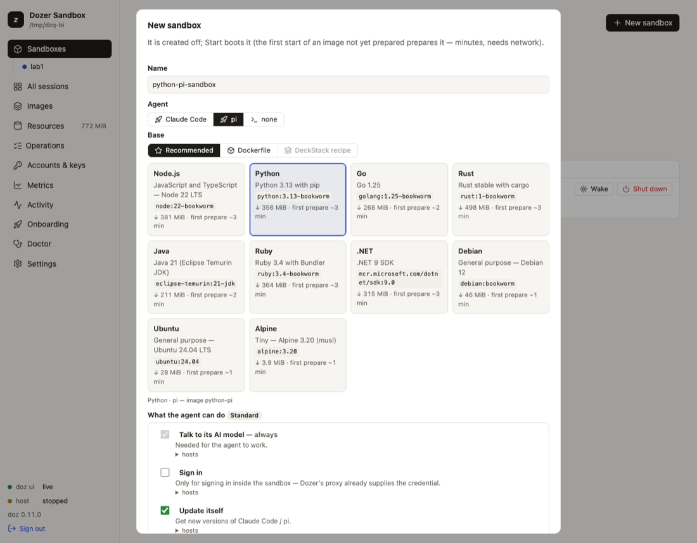
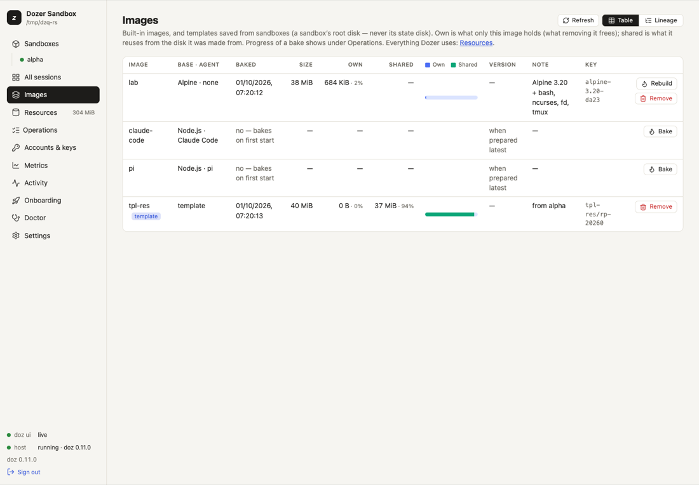

# Images and bases

Every sandbox starts from an **image**: a prepared disk with a Linux system, a developer toolkit and,
usually, an AI agent. You choose an image when you create a sandbox; Dozer prepares it the first time
it's needed and then makes each sandbox an instant copy of it.

## Concepts

- **An image is two choices: an agent and a base.**
  - The **agent**: **Claude Code**, **pi**, **Codex** ([Codex](24-codex.md)), or **none** (a shell only).
  - The **base**: the Linux system underneath — one of the **recommended bases** (below), **your own
    Dockerfile**, or a **template** you saved from a sandbox.
- **Image names** follow the pair: `<base>-<agent>`, for example `python-claude-code` or `go-pi`, and
  just `<base>` with no agent (`debian`). Three names predate the choice and stay:

  | name | base | agent |
  |---|---|---|
  | `claude-code` | Node.js | Claude Code |
  | `pi` | Node.js | pi |
  | `codex` | Node.js | Codex (new — on other bases `<base>-codex`) |
  | `lab` | Alpine | none (bash and a few tools) |

- **The developer baseline.** On every base, Dozer adds the tools agents expect: git, curl, jq,
  ripgrep (`rg`), fd, python3, less, vim, ssh, sudo, tmux and the package lists, so the agent can
  install more with `sudo apt-get install` (or `apk add` on Alpine). Claude Code on a base without
  Node is its standalone build; pi on a base without Node gets its own Node; Codex is its official
  static linux-arm64 build on every base.
- **Preparing** an image downloads the base (digest-pinned), installs the baseline and the agent in a
  temporary VM, and checks the result. Minutes, once, with the network. A sandbox started while its
  image is being prepared joins that preparation.
- **Copies are free.** A sandbox's disk is an APFS clone of its image: it costs almost nothing until
  it changes.

## The recommended bases

`doz base ls` lists them, with the exact image each follows, its download, how long a first
preparation takes, and which package registries its sandboxes may reach:

| base | what's in it |
|---|---|
| `node` | Node.js 22 on Debian |
| `python` | Python 3.13 on Debian |
| `go` | Go 1.25 on Debian |
| `rust` | Rust on Debian |
| `java` | Java 21 (Eclipse Temurin) |
| `ruby` | Ruby 3.4 on Debian |
| `dotnet` | .NET 9 SDK |
| `debian` | plain Debian |
| `ubuntu` | Ubuntu 24.04 |
| `alpine` | Alpine 3.20 |

A base's own package registry (PyPI for `python`, crates.io for `rust`, …) is part of what its
sandboxes may reach by default. See [What the agent can do](10-permissions-and-network.md).

## Choose an image — in the terminal

```sh
doz create web --image claude-code --workspace ~/code/web              # Node · Claude Code
doz create api --agent claude-code --base python --workspace ~/code/api
doz create tools --agent none --base go --isolated                      # a Go shell, no agent
doz create mine --agent pi --dockerfile ~/code/mine/Dockerfile          # your own base
doz create tpl-copy --image my-template                                 # a template
```

`--image` is shorthand for `--agent` and `--base`. `doz up` takes the same options.

## Choose an image — in the dashboard

**New sandbox** shows two rows: **Agent** (Claude Code · pi · none) and **Base** — **Recommended**
(a card per base, with its download and time), **Dockerfile** (**Choose Dockerfile…** opens the Mac's
file picker) or **Template**. The line under them names the image the pair makes.



## Your own Dockerfile

Use a Dockerfile when a recommended base isn't close enough — your company's image, extra system
libraries, a pinned toolchain. Dozer builds it with **Apple's `container` tool**, then adds its
baseline and the agent on top as usual.

- **Apple's tool is optional**, installed and started only when you ask:

  ```sh
  doz builder status        # installed? supported? running?
  doz builder install       # opens Apple's signed installer package in macOS Installer (you approve it there)
  doz builder start         # starts its services (asks first)
  ```

  In the dashboard, choosing **Dockerfile** shows the same state, with **Install Apple's container
  tool…** or **Start its services** when needed. Dozer never uses `sudo` for it.
- **The build runs outside Dozer's network policy.** The Dockerfile's `RUN` steps run in Apple's
  builder and reach the internet directly, without Dozer's proxy or permissions. Only build
  Dockerfiles you trust. The sandbox made from the image is under your permissions as usual.
- The Dockerfile's folder is the build context, and the sandbox's workspace unless you give one.
- An unchanged Dockerfile prepares again in seconds. When it changes, Dozer says "Dockerfile changed —
  rebuild available"; `doz image bake df-…` rebuilds (the image's name is shown in `doz image ls`),
  and `doz reset NAME` moves a sandbox onto it.
- Apple's tool keeps its own storage, shown on the Resources page (never deleted by Dozer). See
  [Resources and disk space](13-resources-and-disk-space.md).

## See and manage images

Each image's **STATUS** (also on the Images page, and `status` in `--json`) is one of: **up to date**,
**update available** (a newer agent release), **older recipe** (an older Dozer prepared it), **not
prepared** (it's prepared the first time it's needed) or **preparing**.

```sh
doz image ls                   # every image and template: baked here?, its agent version, status
doz image ls --tree            # the lineage: base → image → template → sandboxes, with sizes
doz image bake claude-code     # prepare (or rebuild) now rather than at the first start
doz image rm python-pi         # remove an image's prepared disk (sandboxes made from it keep working)
```

In the dashboard, **Images** shows the same with **Bake** or **Rebuild** on each row and **Remove…**
under its **⋯**, each image's
own and shared disk space as a bar, and **Lineage**, the tree.



## Out-of-date images

An image can fall behind in two ways: a **newer agent release** exists, or it was prepared by an
**older version of Dozer** whose recipe lacked something (a tool the baseline gained, for example).
Either way, **Dozer never rebuilds an image without you.** It says so:

- `doz image ls` — a STATUS column (`update available`, `older recipe`) and a line such as
  `pi: prepared by an older doz — this doz's image adds: sudo, apt-utils, tmux, package lists`;
- `doz doctor`, the **Images** page (a badge and **Rebuild**), and a sandbox's page;
- **when you create a sandbox**, which asks:

  ```
  The claude-code image is out of date: … Rebuild it first (~2 min, needs network; existing sandboxes are NOT affected)?
  ```

  **Enter** uses the current image. `--rebuild` or `--use-current` decide up front; without a terminal
  the current image is used with a warning. The dashboard's New sandbox shows the same choice.

Rebuilding never touches existing sandboxes: they keep their disks. To move a sandbox onto the new
image, `doz reset NAME` — it keeps the agent's own state (`~/.claude`, `~/.pi`) and `/workspace`, and
drops everything else installed on its system disk (take a [template](12-restore-points-duplicates-templates.md#templates)
first if you want that).

## Templates

A **template** is a sandbox's system disk saved as an image: set a sandbox up the way you like, then
make new sandboxes from it. It never includes the agent's state disk (logins, history). See
[Restore points, duplicates and templates](12-restore-points-duplicates-templates.md#templates).

## Settings

| key | default | what it does |
|---|---|---|
| `defaults.image` | `lab` | The image used when you don't name one (onboarding sets it to your choice). |
| `images.claude_code_version` | `latest` | The Claude Code version an image is prepared with: `latest` (resolved at preparation) or an exact version like `2.1.227`. |
| `images.pi_version` | `latest` | The same for pi. |
| `images.lab.memory_mib` · `images.claude-code.memory_mib` · `images.pi.memory_mib` | `1024` · `2048` · `2048` | Memory of a new sandbox of each image. |
| `images.lab.network` · `images.claude-code.network` · `images.pi.network` | `bake` · `agent` · `agent` | Network of a new sandbox of each image. |
| `resources.clean_unused_days` | `30` | Clean up removes a prepared image no sandbox was made from in this many days. |

## Limits

- Images can't yet be pulled from or pushed to a registry (`doz image pull` / `push` answer "not yet").
- A Dockerfile base must be for `linux/arm64` and needs Apple's `container` tool on this Mac.
- A sandbox keeps the image it was made from; only `reset` (or a new sandbox) changes that.

## Troubleshooting

| symptom | what to do |
|---|---|
| The first start takes minutes | The image is being prepared (once). `doz onboard --status` or the dashboard's Operations show it. |
| A preparation failed | `doz image bake NAME -v` shows each step and its output; a network refusal during preparation is in `doz net log`. |
| "Dockerfile changed — rebuild available" | `doz image bake df-…` (the name is in `doz image ls`), then `doz reset NAME`. |
| `doz builder status` says not installed | `doz builder install`, approve it in Installer, then `doz builder start`. |
| An image says "older recipe" | Rebuild when it suits you (`doz image bake NAME` or **Rebuild**), then `doz reset` the sandboxes you want on it. |
