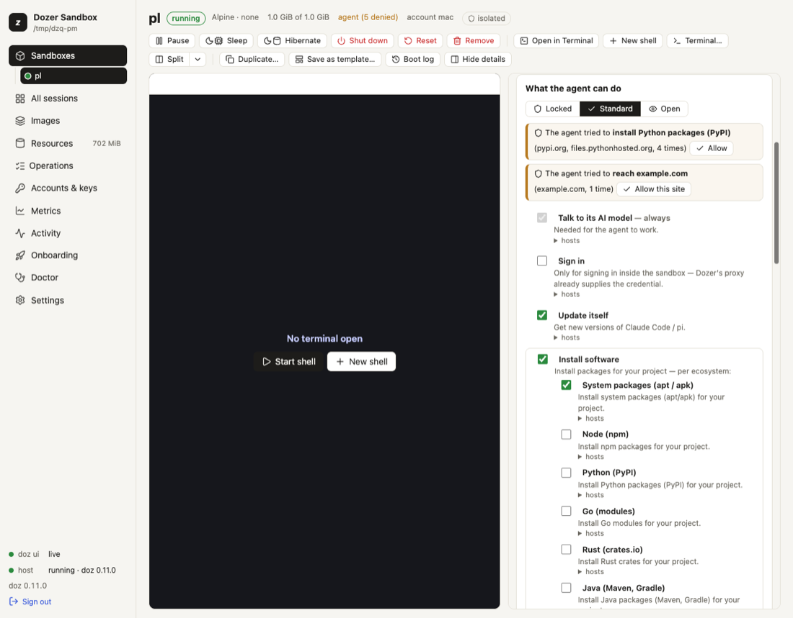

# What the agent can do: permissions and the network

A sandbox has **no network card**. Its only way out is a proxy in Dozer's host, on your Mac, which
checks every connection against the sandbox's **permissions** — a short list of plain-language
switches — and logs it. You decide what the agent may reach; the agent can't change it.

## Concepts

- **Permissions** are what an agent may do, each a switch:

  | permission | id | what it allows | in Standard |
  |---|---|---|---|
  | Talk to its AI model | `model` | Anthropic's API | always on |
  | Talk to OpenAI | `model:openai` | Codex's model (`chatgpt.com`, `api.openai.com`) — [Codex](24-codex.md) | always on in a Codex sandbox; never in another agent's |
  | Sign in | `sign-in` | Claude's sign-in pages, for signing in *inside* the sandbox | off (Dozer supplies the credential) |
  | Update itself | `update` | new versions of Claude Code or pi | on |
  | Install software — system packages | `install:system` | apt / apk | on |
  | Install software — Node, Python, Go, Rust, Java, Ruby, .NET | `install:node`, `install:python`, `install:go`, `install:rust`, `install:java`, `install:ruby`, `install:dotnet` (`install` = all) | that language's package registry | your base's language |
  | Use GitHub | `github` | clone and fetch code; Claude Code's plugins | on |
  | Use GitHub as you | `github:as-you` | git and gh signed in as you — read-only ([GitHub as you](18-github.md)) | off, in every preset |
  | Push to GitHub | `github:push` | also push and change things on GitHub as you | off, in every preset |
  | Send error reports | `error-reports` | the agent reporting its own crashes to its maker | on |
  | Browse the web | `web` | any website | off — **the agent could send your code anywhere** |
  | Sites you allow | `site:HOST` | one host (`api.example.com`, or `*.example.com`) | none |

  `doz net permissions` lists every permission with the exact hosts behind it in your version of Dozer.
- **Presets:** **Locked** (its AI model only), **Standard**, **Open** (everything, still logged). Your
  GitHub login is never part of a preset — not even Open: it's switched on by name, and a preset you
  choose later keeps it as it was.
  New sandboxes get the setting `defaults.permissions` (`standard`).
- **Stored by name.** A sandbox remembers "Update itself", not a list of hosts, so when a new version
  of Dozer adds a host to a permission, every sandbox that has it gets it.
- **Live.** A change applies to the sandbox's next connection — no restart — and is kept for its
  next start.
- **Everything is logged:** host, verdict, rule, bytes. Never the contents.

## See what the agent can do

```sh
doz net my-app            # the checklist, its sites, and what it was refused lately
doz net log my-app        # the connection log
doz net log my-app --denied --follow
```

When the agent was refused something a permission would allow, `doz net` says so — "the agent tried
to install Python packages (PyPI), 3 times" — with the command that allows it.

## Change it — in the terminal

```sh
doz net allow my-app install:python          # switch a permission on
doz net allow my-app site:api.example.com    # one site
doz net deny my-app github                   # switch one off
doz net deny my-app site:tracker.example.com
doz net allow my-app locked                  # or standard, open: a preset
doz net allow my-app web --yes               # asks first without --yes
doz create my-app --allow install:rust,site:api.example.com,-error-reports
```

`--allow` on `create` and `up` adds to the default: permission ids, `-PERMISSION` to remove one,
`site:HOST`, or a preset name.

## Change it — in the dashboard

On a sandbox's page, the details' **Network** tab › **What the agent can do** shows the presets (**Locked** ·
**Standard** · **Open**) and the permissions as switches, with its sites below. Flip a switch and it
applies at once; each permission's **hosts** unfold beneath it. When the agent was refused something, a line
says so — "The agent tried to install Python packages (PyPI)" — with **Allow** (or **Allow this
site**). **Browse the web** asks you to confirm first. **Details: the rules and hosts** shows every
host behind the switches, and **Edit policy…** edits the raw rules with a preview of exactly what
changes.



New sandbox shows the same switches (preset from the base you chose), and the **Settings** page
edits `defaults.permissions` with them.

## The network kinds

`--network` on `create` (and `network:` in `doz_project.yaml`) chooses how a sandbox is connected:

| `--network` | what it is |
|---|---|
| `agent` | proxied, with the **Standard** permissions (the default for agent images) |
| `locked` | proxied, **Locked**: the agent's model only |
| `open` | proxied, **Open**: everything, still logged |
| `bake` | proxied, package registries only (the default for `lab`, and what image preparation uses) |
| `nat` | a real network card through macOS's NAT: **not** filtered or logged |
| `none` | no network at all |

The proxied kinds have no network card: every connection, DNS included, goes through the proxy.
`nat` and `none` are the virtual machine's make-up, fixed when the sandbox is made.

## The raw rules

Under the permissions there are rules, which you can still edit directly:

```sh
doz net policy my-app                                   # show
doz net policy my-app --allow github.com --allow '*.githubusercontent.com'
doz net policy my-app --deny example.com --remove github.com
doz net policy my-app --preset open                     # replace with a preset: locked, bake, agent, open
```

Your own rules win over a permission's hosts. A host your rules can't allow doesn't even resolve.

## Settings

| key | default | what it does |
|---|---|---|
| `defaults.permissions` | `standard` | What a new sandbox's agent may do: `standard`, `locked`, `open`, or Standard with changes like `+web,-error-reports`. |
| `images.claude-code.network` · `images.pi.network` · `images.lab.network` | `agent` · `agent` · `bake` | The network kind of a new sandbox of each image. |
| `defaults.nat_subnet` | (a free one) | The subnet of a new `nat` sandbox (`$DOZ_SUBNET`). |

## Limits and security

- **Browse the web** and **Open** let the agent send your code and data anywhere. Prefer a
  `site:HOST` for what the agent really needs.
- **A Dockerfile build runs outside this policy** (in Apple's builder); the sandbox made from it
  doesn't. See [Images and bases](08-images-and-bases.md#your-own-dockerfile).
- IPv4 only; HTTP/2 isn't passed through on the hosts whose traffic the proxy inspects; UDP is refused
  (programs fall back to TCP).
- There are no general port forwards from your Mac into a sandbox. The one exception is a sign-in's
  callback, briefly — see [Signing in from a sandbox](11-signing-in-from-a-sandbox.md).
- A sandbox made with an older version of Dozer keeps its rules; `doz net NAME` shows them as the
  permissions they amount to, and its first permission change stores them as permissions (anything
  no permission covers stays as your own site rules).

## Troubleshooting

| symptom | what to do |
|---|---|
| A package install fails | `doz net NAME` says what was refused and which permission allows it: `doz net allow NAME install:python`. |
| The agent can't reach your company's API | `doz net allow NAME site:api.example.com`. |
| A site works in your browser but not in the sandbox | `doz net log NAME --denied` shows the refused host — sites often use a second host for assets or APIs. |
| Claude Code can't update itself | `update` must be on (it is in Standard). |
| You need the whole web for a while | `doz net allow NAME web`, then `doz net deny NAME web` when done. |
