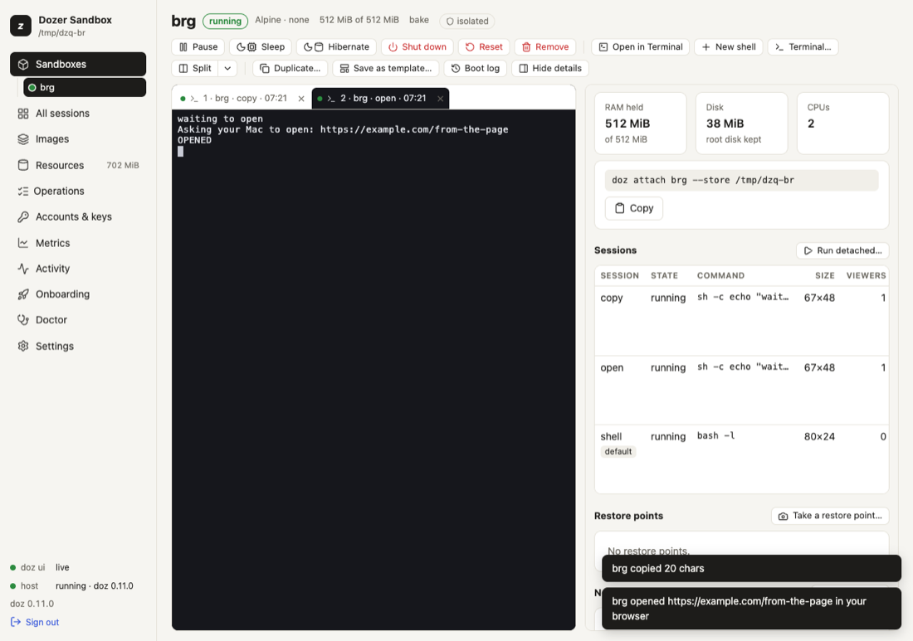

# Signing in from a sandbox

Many command-line tools sign you in through a web browser: they open a sign-in page, you sign in,
and the provider sends your browser back to the tool on `http://localhost:PORT`. A sandbox has no
browser and its `localhost` isn't your Mac's — so Dozer bridges both: the page opens in **your Mac's
browser**, and the redirect at the end finds its way back **into the sandbox**.

You rarely need this for Claude itself — Dozer supplies Claude's credential already (see
[Agents and accounts](09-agents-and-accounts.md)). It's for everything else an agent may sign in to:
a cloud CLI, a SaaS tool's CLI, an MCP server's OAuth.

## Concepts

- **The browser bridge.** Inside every sandbox, `xdg-open` — and `$BROWSER`, `open`,
  `sensible-browser`, `www-browser` — is Dozer's own small program. It hands an **http or https**
  address to your Mac, which opens it in your default browser. You're told every time:
  `my-app opened https://example.com/docs in your browser`. Nothing is printed into the session itself
  — the agent's screen stays exactly as it drew it; when an address is refused, the program that asked
  hears why (its error output and exit status). (Given a document in `/workspace` instead of an address, the same program opens that file
  on your Mac — see [Opening workspace files on your Mac](07-terminals-and-sessions.md#opening-workspace-files-on-your-mac).)
- **The sign-in callback.** When the address asks the provider to send the browser back to the
  sandbox's `localhost:PORT` (its `redirect_uri`), Dozer first opens your Mac's `localhost:PORT` and
  forwards it into the sandbox, then opens the page. The notice says
  `sign-in callback localhost:PORT forwarded (10 min)`. When your browser lands on the callback, the
  tool in the sandbox receives it and the sign-in completes.
- **It lasts the sign-in, no longer.** The forward is on your Mac's loopback only (nothing else on
  your network can reach it), one per sandbox (a new sign-in replaces it), and it closes 3 seconds
  after the callback was answered, or after 10 minutes.
- **Only while you watch.** Like the clipboard bridge, it works while a terminal (yours, or a
  dashboard tab) is attached to the session.

## Sign in

1. Attach to the session — `doz attach my-app`, `doz up`, or a terminal in the dashboard.
2. Run the tool's sign-in command in the sandbox (for example `gh auth login --web`, `gcloud auth
   login`, or the tool's `/login`).
3. Your Mac's browser opens the sign-in page, and a notice appears:
   - in `doz attach`, over the bottom row: `my-app opened https://… · sign-in callback localhost:8765 forwarded (10 min)`;
   - in the dashboard, a message in the corner.
4. Sign in as usual. The browser's last redirect reaches the tool in the sandbox; the tool says it's
   signed in. The forward closes a few seconds later.



Programs that open a page without a sign-in (documentation, a report) just open in your browser.

## What is refused (and said)

- anything but `http` and `https` — `file:`, `javascript:`, custom schemes;
- an address on the Mac's own loopback — `http://localhost:3000` from inside a sandbox means the
  **sandbox's** own server, which your Mac's browser can't reach. (Tell the person the address; there
  are no general port forwards.)
- more than 3 addresses in 10 seconds, or an address over 2048 characters;
- a callback port already in use on your Mac: the page still opens, and the notice says the sign-in
  can't come back.

## Turn it off

```sh
doz config set --sandbox my-app sandbox.browser_bridge off    # this sandbox (applies at once)
doz config set sandbox.browser_bridge off                     # every sandbox without its own choice
doz create my-app --browser-bridge off …                      # from the start (or browser_bridge: off in doz_project.yaml)
doz config show --sandbox my-app                              # this sandbox's own values, and whose value each is
```

Off, nothing opens and nothing is forwarded; the notice says the bridge is off. The agent is told
either way, so it knows to print addresses for you instead.

## Sign-ins and permissions

The sign-in page opens on **your Mac**, outside the sandbox, so it doesn't need a permission. But the
tool inside may need to reach the provider's API afterwards: allow it as a site
(`doz net allow my-app site:api.example.com`). For Claude's own sign-in pages there is a **Sign in**
permission (off in Standard); with the default key policy a sign-in inside a sandbox that uses a
token or API key is refused on purpose. See [What the agent can do](10-permissions-and-network.md)
and [Agents and accounts](09-agents-and-accounts.md#a-credential-the-agent-brings-itself).

## Settings

| key | default | what it does |
|---|---|---|
| `sandbox.browser_bridge` | `on` | `on`: xdg-open reaches your Mac's browser and a sign-in's callback is forwarded. `off`: never. Per sandbox too. |

## Limits and security

- **A sandbox can open web pages on your Mac.** Every one is announced and rate-limited, and only
  http(s) pages that aren't on your Mac's own loopback. If you don't want that for a sandbox, turn
  the bridge off for it.
- **The forward is narrow:** one port, on your Mac's loopback, for one sign-in, at most 10 minutes.
  The address's query (which carries the sign-in's secret state) never appears in notices or logs —
  only the scheme, host and path.
- The bridge arrives with a sandbox's next start; a sandbox woken from an older version of Dozer gets
  it at its next session.

## Troubleshooting

| symptom | what to do |
|---|---|
| Nothing opens | Is a terminal attached to the session? Is the bridge on (`doz config show --sandbox NAME`)? Does the tool use `xdg-open` or `$BROWSER`? Some print the address instead — open it yourself. |
| "localhost:PORT is in use on this Mac" | Something on your Mac uses that port. Quit it, or use the tool's device-code sign-in if it has one. |
| The browser says it can't connect at the end | The forward closed (10 minutes) or the tool in the sandbox stopped waiting. Start the sign-in again. |
| The tool signs in but then can't reach its API | `doz net NAME` shows the refusal; allow the site. |
| "only http and https URLs are opened" | The program asked to open a file or another scheme; that's never bridged. |
