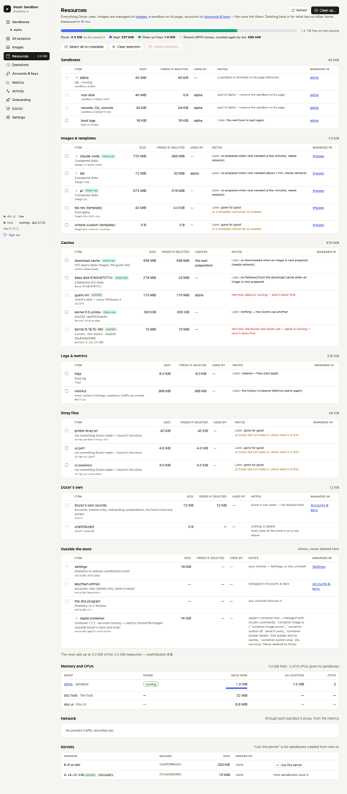

# Resources and disk space

Dozer keeps everything in one folder, the **store**. `doz resources` — and the dashboard's
**Resources** page — accounts for every byte of it, shows the memory, CPUs and network your sandboxes
use, and deletes what can safely go.

## Concepts

- **Sizes are real disk use.** Dozer's disks are APFS clones: a sandbox shares most of its blocks with
  its image, and a restore point with its sandbox. So each row shows three numbers:
  - **size** — the disk space it occupies, counted in full;
  - **freed if deleted** — what deleting it would actually give back (only the blocks nobody else
    shares);
  - **used by** — what depends on it.
- **Everything adds up.** The rows add up to the total that `du` reports for the store. A last row,
  **unattributed**, is what no row explains; it should be 0.
- **Re-creatable vs. yours.** A download cache, an unused prepared image or an old kernel can be made
  again (it costs time and network later). A sandbox, a restore point or a template can't — those are
  yours.

## See it — in the terminal

```sh
doz resources               # every byte of the store, then memory, CPUs, traffic and kernels
doz resources --json
```

The groups: **Sandboxes** (each one's system disk, state disk, sleep snapshot, restore points, saved
screens and boot logs), **Images & templates**, **Caches** (the download cache, base disks, the boot
disk, kernels, preparation leftovers, and the **tools layer** — `gh`, downloaded once for sandboxes with
GitHub as you; see [The tools layer](19-the-tools-layer.md)), **Logs & metrics**, **Stray files**, Dozer's own records — and
**Outside the store**: your settings file, keychain entries by name, the `doz` program, project
folders and Apple's `container` storage. Those outside rows are shown, never deleted here.

## Free space

```sh
doz resources clean --dry-run          # what Clean up would delete, and what each frees
doz resources clean                    # asks once
doz resources rm cache:downloads kernel:6.12.1 --dry-run
doz resources rm point:web/3           # by id, as doz resources lists them
```

- **Clean up** deletes what is **re-creatable and unused**: the download cache, the tools layer's cache, base disks, kernels
  nothing needs, images no sandbox was made from in the last `resources.clean_unused_days` (30) days,
  and leftovers. It **never** deletes templates, sandboxes, restore points, settings or keys; logs and
  metrics are kept too (select them yourself to clear them).
- **`rm`** deletes what you name, after showing the plan: each item, what it frees, what it costs
  later ("prepared again when next needed, about 3 min, needs network"), and anything refused and why.
- **Nothing breaks a sandbox.** Refused, always: a sandbox's own disks (remove the sandbox instead);
  the kernel and boot disk while any sandbox is asleep or running (their snapshots need them); an
  image being prepared; a folder that is a sandbox's workspace; anything outside the store.
- The deletion waits until nothing that uses the disks is under way (a start, a wake, a preparation),
  and runs as one operation.

## In the dashboard

**Resources** in the sidebar (its total is shown beside it). The bar on top splits Dozer's total into
what it keeps, what **Clean up** would free and the blocks clones share, with the disk's free space
beside it; under it, a strip that jumps to each group (with its size) — a group's heading folds it, and
the dashboard remembers which you folded. Then the rows, each linking to where it's managed: an image to **Images**, a
sandbox's parts to **its page**, accounts to **Accounts & keys**.

1. Tick what should go, or **Select all re-creatable**.
2. **Delete selected…** — one confirmation lists each item, what it frees and what it costs later.
3. Or **Clean up…** for the safe set.

The page measures when you open it, on **Refresh**, and when an operation ends.



## Memory, CPUs, traffic and kernels

The same report shows the memory each running sandbox holds (and the host's and the dashboard's),
the CPUs given to sandboxes, each sandbox's network traffic through the proxy (today and in all), and
the Linux kernels. **Use this kernel** (or `doz resources kernel kernel:VERSION`, or `pinned` for
this version's own) picks the kernel **new** sandboxes boot; existing ones keep theirs.

## Apple's `container` storage

If you build Dockerfile bases, Apple's `container` tool keeps its own images and data outside Dozer's
store. The Resources page shows it as an **Outside** row — its data folder by part, the program, and
the images Dozer built with it — so you know where the space went. Dozer never deletes it; manage it
with Apple's `container` command.

## Settings

| key | default | what it does |
|---|---|---|
| `resources.clean_unused_days` | `30` | Clean up removes a prepared image no sandbox was made from in this many days (1–3650). It's prepared again when next needed. |
| `host.boot_logs_kept` | `5` | Boots kept per sandbox. |
| `store.path` | `~/Library/Application Support/dozer-sandbox` | Where the store is. |

## Troubleshooting

| symptom | what to do |
|---|---|
| The **unattributed** row isn't 0 | Something in the store no row explains. `doz resources --json` lists it under stray files; report it if it keeps growing. |
| "refused: … a sandbox's disk" | Remove or reset the sandbox instead; Resources never deletes a live sandbox's disks. |
| Clean up freed less than the sizes suggested | Sizes count shared blocks in full; "freed" counts only what nothing else shares. |
| The Mac's disk is still full | Look at **Outside the store**: Apple's container storage and your project folders are yours to manage. |
