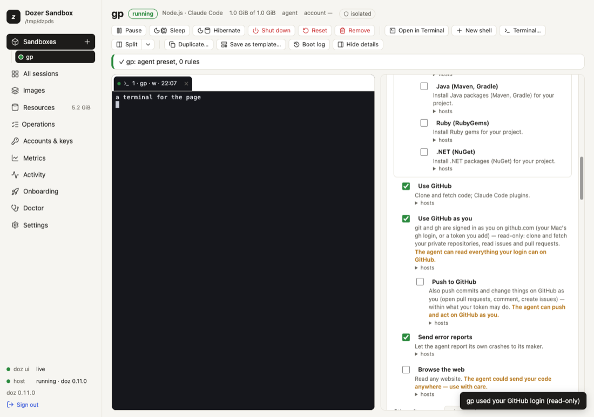

# GitHub as you

An agent on your Mac uses `git` and `gh` as you: it clones your private repositories, opens pull
requests, comments on issues. An agent in a sandbox can do the same — **without your token ever
entering the sandbox**. Dozer's proxy, on your Mac, puts your login into each request on its way to
GitHub, the same way it supplies the agent's AI credential.

It's **off** until you choose it — for every new sandbox (the setup's **Access** step, or `doz access
set --github read`), or for one sandbox — and **read-only** until you also allow pushing.

## Concepts

- **Use GitHub as you** — a permission (in the sandbox's permissions, beside "Use GitHub"). While it's
  on, `git` and `gh` in the sandbox are signed in to github.com as you. Inside, `GH_TOKEN`,
  `GITHUB_TOKEN` and git's login hold only a **placeholder** (`doz_cred_…`); the proxy swaps your real
  token in on the way to `github.com`, `api.github.com`, `uploads.github.com` and `codeload.github.com`
  — and only there. A placeholder sent anywhere else is refused.
- **Read-only** (the default when it's on): clone, fetch, pull, `gh repo view`, reading issues and pull
  requests. **Refused**, with a message that says how to allow it: `git push`, and anything that changes
  something on GitHub — creating issues or pull requests, comments, edits, deletes, and GraphQL
  mutations.
- **Push to GitHub** — a second permission under the first: the agent can push and act on GitHub as you,
  within what your token may do. Every such request is in the sandbox's network log (method and path —
  never a body, never the token).
- **Where your token comes from** — the setting `github.credentials`:
  - `gh` (the default): your Mac's own `gh` login, read when it's used (`gh auth token`) and kept in
    the proxy's memory for a few minutes — never written anywhere. Signing out of `gh` on the Mac
    (`gh auth logout`) ends it.
  - `key`: only a token you give — a sandbox's own, else the default one you gave in the Access step
    (below). A **fine-grained token** limited to the repositories the agent works on is the safest
    choice.
  - `off`: never, even with the permission on.
- **Your identity** — your `user.name` and `user.email` from the Mac's global git config are copied
  into the sandbox's git config (they're not secrets), so the agent's commits are yours. They're gone
  when you turn the permission off.
- **`gh` is installed for you** — part of the [tools layer](19-the-tools-layer.md): while GitHub as you is
  on, Dozer copies the GitHub CLI into the sandbox (downloaded once to your Mac, a pinned version whose
  sha256 is checked; on any base, without the sandbox's network). It is removed when you turn the
  permission off.

## gh in the sandbox

`gh` needs no login of its own: it reads `GH_TOKEN`, the placeholder, and the proxy does the rest.

```sh
gh auth status          # ✓ Logged in to github.com account you (GH_TOKEN)
gh repo view OWNER/REPO
gh pr list
gh issue view 12        # reads work; creating or commenting needs Push to GitHub
```

Its git protocol is HTTPS (the default), so `gh repo clone` uses the same login as `git`. The first start
shows `tools: gh 2.102.0 — for GitHub as you`; `doz tools NAME` shows it later. If it could not be set up
(an offline Mac on the first use), the start goes on without it and the next start or wake tries again —
or `doz tools NAME --apply`.

## For every new sandbox: the Access step

Setup's **Access** step ([Setting up](03-setting-up.md)) asks once — *Off*, *Read-only* or *Read and
push*, from this Mac's `gh` login or a token you paste — and **confirms it with the real token**: one
`GET https://api.github.com/user` through the same proxy leg the sandboxes use.

```
✓ GitHub as you   read (gh login)  confirmed — signed in as you — scopes: repo, read:org (from this Mac's gh login)
✓ GitHub as you   read (a key)     confirmed — signed in as you — it can see 3 repositories (from your key)
✗ GitHub as you   push (gh login)  not confirmed — this Mac's gh is not logged in to github.com — run gh auth login on the Mac
```

A classic token shows its **scopes**; a fine-grained token has none to show, so you see **how many
repositories** it can see instead. A check that fails says why; **Skip** keeps your choice (not
confirmed), **Turn it off** turns it off. Again at any time:

```sh
doz access                                   # confirm it now (and the Claude account, the SSH agent)
doz access set --github push                 # new sandboxes: read and push
doz access set --github read --github-key    # paste a token (no echo) — github.credentials becomes key
doz access set --remove-github-key
doz access set --github off
```

The choice is the setting `defaults.github`: **new** sandboxes — `doz new`, `create`, `up`, Quick add
and New sandbox — get **Use GitHub as you** (and **Push to GitHub** for `push`) switched on. A sandbox
can still differ (`doz create --github off`, its own switches); existing sandboxes don't change. The
token you paste is kept in your login keychain as `doz-github`; a sandbox's own token wins over it.

## Turn it on for one sandbox

In the dashboard: the sandbox's **Permissions** → **Use GitHub as you** (and **Push to GitHub** under
it). Each asks first.



From the command line:

```sh
doz net allow my-app github:as-you          # read-only
doz net allow my-app github:push            # also push (turns on github:as-you too)
doz net deny my-app github:push             # back to read-only
doz net deny my-app github:as-you           # off — every placeholder already issued stops working at once
doz create my-app --github read             # from the start: off, read or push (github: in doz_project.yaml)
```

It needs a proxied sandbox (the `agent`, `locked` or `open` network — the default for agent images).
A change applies at once to the proxy; a session started before you turned it on gets the placeholder
at its next start.

The first time the sandbox uses your login after you turn it on (or change it), your terminal and the
dashboard say so: `my-app used your GitHub login (read-only)`.

## Use a token instead of your gh login

```sh
doz access set --github-key < token.txt     # the default token for every sandbox (keychain: doz-github); sets github.credentials = key
doz key set my-app --github < token.txt     # this sandbox's own token (or --keychain SERVICE to read it from the keychain)
doz key rm my-app --github
```

A sandbox's own token given on stdin is held in the host's memory — give it again after the host
restarts, or keep it in the keychain. A sandbox's own token wins over the default one and over `gh`
whatever the setting says (unless it's `off`).

## SSH (optional)

SSH is encrypted end to end, so the proxy can't put a login into it. Instead, Dozer can forward your
Mac's **ssh-agent** into the sandbox: `ssh` and git over SSH there can ask your agent to sign, but
your keys never leave the Mac. The sandbox may only list your agent's keys and ask for signatures —
adding, removing or locking keys is refused before it reaches your agent.

```sh
doz config set --sandbox my-app sandbox.ssh_agent on    # or doz create --ssh-agent on, ssh_agent: on in doz_project.yaml
doz config set --sandbox my-app sandbox.ssh_agent off
```

While it's on, sessions get `SSH_AUTH_SOCK`, and the network allows `github.com:22` — nothing else
over SSH. You're told the first time it's used. Your Mac needs a running ssh-agent with a key in it
(`ssh-add -l` on the Mac). For every new sandbox: the Access step, or `doz access set --ssh-agent on`
— it's confirmed by asking your agent for its keys ("the ssh-agent has 2 keys").

The [tools layer](19-the-tools-layer.md) makes SSH work on any base:

- an **ssh client** is installed (`openssh-client`, with `apt` or `apk` through the proxy) when the image
  has none;
- **github.com's host keys** — the ones GitHub publishes, built into Dozer — are written to
  `/etc/ssh/ssh_known_hosts`, so the first `ssh -T git@github.com` or `git clone git@github.com:…` never
  asks "Are you sure you want to continue connecting?" and never trusts a key it was handed. Both go
  again when forwarding is turned off (the keys file keeps anything else in it).

```sh
ssh -T git@github.com     # Hi you! You've successfully authenticated…
git clone git@github.com:OWNER/REPO.git
```

## What the agent is told

One line in its facts — that `git` and `gh` are signed in as you, read-only or with push, and to use
HTTPS remotes (and SSH, when the agent is forwarded) — and the details in its `dozer` skill. The line says
when `gh` was installed by Dozer (or, if it could not be, why), and that the ssh client and github.com's
host keys are in place.

## Troubleshooting

| symptom | what to do |
|---|---|
| `git push` says "pushing to GitHub is off" | It's read-only: `doz net allow NAME github:push` (or the switch). |
| `gh` or git says "Bad credentials" / 401 | Is `gh` logged in on the Mac (`gh auth status`)? With `github.credentials = key`, did you `doz key set NAME --github`? |
| git asks for a username and password | The session started before the permission was on: start a new session. Is the remote HTTPS (`https://github.com/…`)? |
| `ssh -T git@github.com` fails | Is `sandbox.ssh_agent` on, and does `ssh-add -l` on the Mac list a key? |
| `doz access` says *GitHub refused the token (401)* | The token was revoked or expired: `gh auth login` again, or paste a new one (`doz access set --github-key`). |
| `gh: not found` | Is GitHub as you on? `doz tools NAME` says whether gh was set up and why not; `doz tools NAME --apply` tries again. |
| A new sandbox didn't get your login | Is `defaults.github` `read` or `push` (`doz access`)? Naming a network (`--network locked`) or exact permissions takes exactly those. |

## Settings

| key | default | what it does |
|---|---|---|
| `defaults.github` | `off` | "GitHub as you" for new sandboxes: `off`, `read` or `push` (the Access step). |
| `github.credentials` | `gh` | Where your GitHub login comes from: `gh`, `key` or `off`. |
| `sandbox.ssh_agent` | `off` | Forward your Mac's ssh-agent (github.com:22 only). Per sandbox too. |

See also: [The tools layer](19-the-tools-layer.md), [What the agent can do](10-permissions-and-network.md), [Security model](16-security-model.md).
